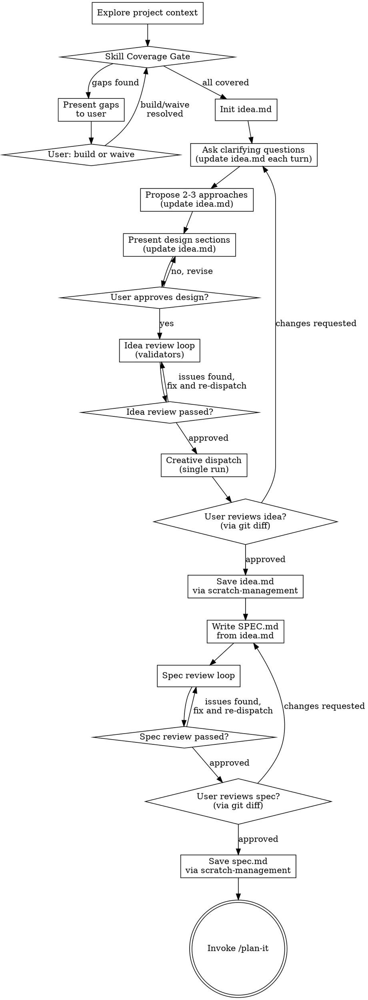

# Brainstorming Ideas Into Designs

Help turn ideas into fully formed designs and specs through natural collaborative dialogue.

Start by understanding the current project context, then ask questions one at a time to refine the idea. Once you understand what you're building, present the design and get user approval.

<HARD-GATE>
Do NOT invoke any implementation skill, write any code, scaffold any project, or take any implementation action until you have presented a design and the user has approved it. This applies to EVERY project regardless of perceived simplicity.
</HARD-GATE>

## Scratch Folder Convention

All brainstorming artifacts live in `scratch/{project}/` (idea.md, spec.md). The `scratch/` directory is its own git subrepo with a separate remote — it has its own `.git` directory and commit history independent of the parent repo. The parent repo's pre-commit hook blocks `scratch/` from being committed to the parent.

To persist scratch files, use the `scratch-management` skill which commits within the scratch subrepo:

- **Save** (checkpoint work): invoke `scratch-management` with "save {project}" — commits and pushes within scratch/
- **Archive** (hide completed folder from agents): invoke `scratch-management` with "archive {project}" — moves to archive branch
- **Do not commit scratch files to the parent repo** — the pre-commit hook will reject it

## Anti-Pattern: "This Is Too Simple To Need A Design"

Every project goes through this process. A todo list, a single-function utility, a config change — all of them. "Simple" projects are where unexamined assumptions cause the most wasted work. The design can be short (a few sentences for truly simple projects), but you MUST present it and get approval.

## Checklist

You MUST create a task for each of these items and complete them in order:

1. **Explore project context** — check files, docs, recent commits
2. **Run skill coverage detection** — from the project context and stated goals, identify all technologies involved (languages, frameworks, databases, infrastructure). Match each to available expert skills by `{technology}-expert` naming convention. Report gaps. **Hard gate:** present each uncovered technology. User must build the skill (exit session) or waive with reason. Record results in idea.md Skill Coverage section.
3. **Visual questions** — for questions where the user would understand better by seeing it, use the `visual-companion` skill to show mockups, diagrams, or comparisons in the browser.
4. **Init idea.md + start visual companion** — create `scratch/{project}/idea.md` from `idea-template.md` with Problem and Context seeded from step 1. Create the directory if needed: `mkdir -p scratch/{project}/`. Then start visual-companion serving `scratch/{project}/` so the user can follow along in the browser as the doc evolves. The server auto-reloads on file changes. Use mermaid diagrams, callout boxes, and other markdown plugins — read `plugin-reference.md` before writing.
5. **Ask clarifying questions** — one at a time; after each decision or new question surfaces, update `idea.md` (Decisions table, Open Questions, Constraints, Scope). The user sees updates live in the browser.
6. **Propose 2-3 approaches** — update `idea.md` with Explored Approaches and selected decision
7. **Present design** — update `idea.md` with remaining sections (Dependencies, Success Criteria, Risks); get user approval per section
8. **Idea review loop** — two phases: (a) dispatch validator subagents in parallel (document-quality, codebase-alignment, domain reviewers); fix issues and re-dispatch until approved (max 3 iterations). (b) After validators pass, dispatch creative-alternatives reviewer (see `creative-alternatives-reviewer-prompt.md`) — single run, output held for step 9.
9. **User reviews idea doc** — present creative suggestions (if any) before the git diff review prompt. Update `idea.md` status to `Complete`, then ask user to review via git diff. If user wants to adopt a suggestion, loop back to step 5. Wait for approval. Save via `scratch-management` only after user approves.
10. **Write SPEC.md** — read `idea.md` in full, then translate its decisions into clean authoritative spec at `scratch/{project}/spec.md` using `spec-template.md`
11. **Spec review loop** — dispatch spec-document-reviewer subagent (see `spec-document-reviewer-prompt.md`); fix issues and re-dispatch until approved (max 3 iterations, then surface to human)
12. **User reviews written spec** — ask user to review `spec.md` via git diff. Wait for approval. Save via `scratch-management` only after user approves.
13. **Transition to implementation** — invoke `/plan-it` to create implementation plan

## Process Flow

**The terminal state is invoking `/plan-it`.** Do NOT invoke frontend-design, mcp-builder, or any other implementation skill. The ONLY command you invoke after brainstorming is `/plan-it`.

## The Idea Document

The idea doc (`idea.md`) is a **living document** maintained throughout brainstorming — not a deliverable written at the end. It captures decisions, rejected alternatives, open questions, and reasoning as they happen. The user sees it rendered in the browser via visual-companion, so use markdown plugins (mermaid diagrams for architecture/flows, callout boxes for important notes, tables for decisions) to make it visually clear.

**When to update idea.md:**
- A decision is made (add to Decisions table, check off related Open Question)
- A new question surfaces (add to Open Questions)
- A constraint or assumption is discovered (add to Constraints & Assumptions)
- Scope is clarified — something is in or out (update Scope section)
- An approach is explored (add to Explored Approaches)
- A risk or unknown is identified (add to Risks & Unknowns)

**When NOT to update idea.md:**
- Exploratory back-and-forth that hasn't produced a decision yet
- Casual conversation or clarification of the question itself

**Template:** See `idea-template.md` for the scaffold structure.

**IDEA.md vs SPEC.md — different documents for different purposes:**

| | idea.md | spec.md |
|---|---------|---------|
| **Audience** | You during brainstorming, future "why?" questions | Implementor (you, `/plan-it`, agents) |
| **Tone** | Exploratory — captures rejected paths and reasoning | Authoritative — only what to build |
| **Lifecycle** | Created early, updated every turn, kept for reference | Created at end, reviewed, handed to planner |
| **Contains** | Decisions + rationale + rejected alternatives + open questions | Architecture + components + data flow + contracts |

## The Spec Document

The spec (`spec.md`) is the **implementation-ready deliverable** translated from the idea doc. It contains only what to build — no rejected alternatives, no "why not" reasoning. Its audience is `/plan-it` and the agents that will execute the plan. The visual-companion server is already running from step 4 — the spec auto-appears in the browser index when created.

**Template:** See `spec-template.md` for the scaffold structure. Scale each section to its complexity.

**What to include vs. omit:**
- **Include:** everything an implementor needs to build without guessing
- **Omit:** rationale for decisions (lives in idea.md), rejected alternatives, open questions (should all be resolved before spec)
- **Scale sections:** a trivial component gets one line; a complex data model gets a full schema. Don't pad simple sections for uniformity.

## The Process

**Understanding the idea:**

- Check out the current project state first (files, docs, recent commits)
- Before asking detailed questions, assess scope: if the request describes multiple independent subsystems (e.g., "build a platform with chat, file storage, billing, and analytics"), flag this immediately. Don't spend questions refining details of a project that needs to be decomposed first.
- If the project is too large for a single spec, help the user decompose into sub-projects: what are the independent pieces, how do they relate, what order should they be built? Then brainstorm the first sub-project through the normal design flow. Each sub-project gets its own spec → plan → implementation cycle.
- For appropriately-scoped projects, ask questions one at a time to refine the idea
- Prefer multiple choice questions when possible, but open-ended is fine too
- Only one question per message - if a topic needs more exploration, break it into multiple questions
- Focus on understanding: purpose, constraints, success criteria

**Exploring approaches:**

- Propose 2-3 different approaches with trade-offs
- Present options conversationally with your recommendation and reasoning
- Lead with your recommended option and explain why

**Presenting the design:**

- Once you believe you understand what you're building, present the design
- Scale each section to its complexity: a few sentences if straightforward, up to 200-300 words if nuanced
- Ask after each section whether it looks right so far
- Cover: architecture, components, data flow, error handling, testing
- Be ready to go back and clarify if something doesn't make sense

**Design for isolation and clarity:**

- Break the system into smaller units that each have one clear purpose, communicate through well-defined interfaces, and can be understood and tested independently
- For each unit, you should be able to answer: what does it do, how do you use it, and what does it depend on?
- Can someone understand what a unit does without reading its internals? Can you change the internals without breaking consumers? If not, the boundaries need work.
- Smaller, well-bounded units are also easier for you to work with - you reason better about code you can hold in context at once, and your edits are more reliable when files are focused. When a file grows large, that's often a signal that it's doing too much.

**Working in existing codebases:**

- Explore the current structure before proposing changes. Follow existing patterns.
- Where existing code has problems that affect the work (e.g., a file that's grown too large, unclear boundaries, tangled responsibilities), include targeted improvements as part of the design - the way a good developer improves code they're working in.
- Don't propose unrelated refactoring. Stay focused on what serves the current goal.

## After the Design

**Idea Review Loop:**
After the user approves the design and idea.md is fully updated:

**Phase a — Validators** (parallel dispatch, fix-and-re-dispatch loop):
1. Dispatch review subagents IN PARALLEL via multiple Agent tool calls in a single message:
   - **document-quality** reviewer (see `idea-document-reviewer-prompt.md`)
   - **codebase-alignment** reviewer (see `codebase-alignment-reviewer-prompt.md`, depth=light)
   - **domain reviewers** — one per covered expert skill from Skill Coverage section
     (see `domain-reviewer-prompt-template.md`, artifact_type=idea, depth=light)
2. If any reviewer returns Issues Found: fix, re-dispatch ALL reviewers
3. Max 3 iterations, then surface to human for guidance

**Phase b — Creative alternatives** (single run, after validators pass):
4. Read idea.md content in full
5. Collect covered expert skill names from idea.md Skill Coverage section
6. Dispatch **creative-alternatives** reviewer (see `creative-alternatives-reviewer-prompt.md`):
   - Paste idea.md content inline as `[IDEA_CONTENT]`
   - Pass skill names as `[SKILL_NAMES]` (reviewer loads them at runtime via Skill tool)
   - If no expert skills are covered (or all waived), pass empty skill names
7. Hold creative reviewer output for step 9

**User Review Gate (idea.md):**
After the idea review loop passes (both phases), update `idea.md` status to `Complete`.

If the creative reviewer returned `**Status:** Suggestions`, present its output (body only, status line stripped) before the git diff prompt:

> Before you review the idea doc, here are some alternatives to consider:
>
> [creative reviewer output body]
>
> ---
>
> Idea doc ready for review at `<path>`. You can review the changes with `git -C scratch diff`. If you'd like to adopt any of the suggestions above, let me know and we'll integrate them. Otherwise, approve and I'll save and move to the spec.

If the creative reviewer returned `No Suggestions` or failed, skip the creative section and use the standard prompt:

> "Idea doc ready for review at `<path>`. You can review the changes with `git -C scratch diff`. Once you're happy with it, I'll save it and translate it into a formal spec."

Wait for the user's response. If they want to adopt a creative suggestion, loop back to step 5 (clarifying questions) to integrate it. If they request other changes, make them and re-run the idea review loop. Once the user approves, save via `scratch-management`, then proceed.

**Writing the Spec:**

- Read `idea.md` in full using the Read tool — do NOT work from conversation memory
- Translate its decisions into a clean, authoritative `scratch/{project}/spec.md` using `spec-template.md`
- The spec contains ONLY what to build — no rejected alternatives, no "why not" reasoning
- Do NOT save yet — save after user approval

**Spec Review Loop:**
After writing the spec document:

1. If the spec introduces technologies not in idea.md's Skill Coverage section,
   re-run skill coverage detection and gate before dispatching reviewers.
2. Dispatch review subagents IN PARALLEL via multiple Agent tool calls in a single message:
   - **document-quality** reviewer (see `spec-document-reviewer-prompt.md`)
   - **codebase-alignment** reviewer (see `codebase-alignment-reviewer-prompt.md`, depth=thorough)
   - **decision-traceability** reviewer (see `decision-traceability-reviewer-prompt.md`)
   - **domain reviewers** — one per covered expert skill from Skill Coverage section
     (see `domain-reviewer-prompt-template.md`, artifact_type=spec, depth=thorough)
3. If any reviewer returns Issues Found: fix, re-dispatch ALL reviewers
4. Max 3 iterations, then surface to human for guidance

**User Review Gate (spec.md):**
After the spec review loop passes, ask the user to review `spec.md` via git diff:

> "Spec ready for review at `<path>`. You can review the changes with `git -C scratch diff`. Let me know if you want to make any changes before we start writing out the implementation plan."

Wait for the user's response. If they request changes, make them and re-run the spec review loop. Once the user approves, save via `scratch-management`, then proceed.

**Implementation:**

- Invoke `/plan-it` to create a detailed implementation plan
- Do NOT invoke any other command. `/plan-it` is the next step.

## Key Principles

- **One question at a time** - Don't overwhelm with multiple questions
- **Multiple choice preferred** - Easier to answer than open-ended when possible
- **YAGNI ruthlessly** - Remove unnecessary features from all designs
- **Explore alternatives** - Always propose 2-3 approaches before settling
- **Incremental validation** - Present design, get approval before moving on
- **Be flexible** - Go back and clarify when something doesn't make sense
- **Capture as you go** - Update idea.md after every decision, not at the end

## Skill Coverage Detection

Identifies technologies involved in the project and checks whether expert skills exist for domain-specific review.

**Detection by phase:**
- **Brainstorming:** Read the project context and user's stated goals — the technologies are obvious from what the design describes (languages, frameworks, databases, infrastructure). No filesystem scanning needed.
- **Planning:** Read the spec and investigation findings — what technologies were discovered during codebase investigation?
- **Implementation (no plan):** Only here should you scan the actual codebase — file extensions, dependency files, imports. This is the only phase where filesystem scanning is appropriate.

**Matching:** Each identified technology → `{technology}-expert` skill name convention. Examples: React → react-expert, TypeScript → typescript-expert, C# → csharp-expert, DynamoDB → dynamodb-expert.

**Gate behavior:**
1. Present gap report to user: list each technology with no matching expert skill
2. **Hard gate** — pipeline stops until user resolves EVERY gap
3. User choices per gap: **build** (exit session, build the skill, resume later) or **waive** (provide reason)
4. Record all decisions in idea.md Skill Coverage section (Covered / Waived with reason / Deferred)
5. Subsequent reviewers check the Skill Coverage section before flagging — already-waived technologies are NOT re-flagged

**Re-check trigger:** If the spec introduces new technologies not in idea.md's Skill Coverage section, re-run detection and gate at spec stage.

