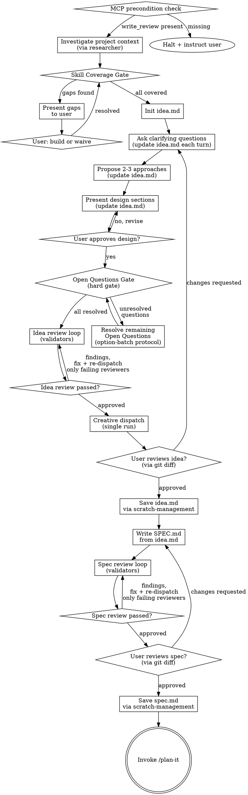

# Brainstorming Ideas Into Designs

Help turn ideas into fully formed designs and specs through natural collaborative dialogue, with idea-review and spec-review loops that use **read-only reviewer sub-agents** persisting verdicts through the `scratch-memory` MCP.

<why-mcp priority="CRITICAL-READ-FIRST">
  Role integrity via MCP boundary:
  - Reviewer agents (`idea-doc-reviewer`, `codebase-alignment-reviewer`,
    `domain-reviewer`, `creative-reviewer`, `decision-traceability-reviewer`)
    have **no Write/Edit/Bash** tools — only Read/Grep/Glob/Skill +
    `mcp__scratch-memory__write_review`.
  - Main session holds Write/Edit for idea.md and spec.md; reviewers
    can't drift into "fix what I'm reviewing" mode.
  - The MCP schema IS the write boundary — reviewers compose only
    the markdown body, server owns path and frontmatter.
  - Main session reads only the `Wrote:` and `Status:` return lines from
    each reviewer agent; finding bodies stay on disk and are never carried
    through main-session context via Agent returns.
</why-mcp>

<mcp-precondition priority="CRITICAL">
  The reviewer sub-agents persist verdicts through the `scratch-memory` MCP.
  Confirm the tool name `mcp__scratch-memory__write_review` appears somewhere
  in this session's tool inventory — either as a callable tool or in the
  deferred-tools system-reminder delivered at session start. Name visibility
  alone is enough; you do NOT need to load its schema via `ToolSearch` or
  run any shell command. MCP tools load at session start — if the name is
  present, the MCP is live; if not, it isn't.

  If `write_review` is NOT available, halt before Step 1 and instruct the user:

  ```
  ERROR: scratch-memory MCP not registered for this project (or running
  an older version without write_review).

  Run:
    cd {PROJECT_DIR}
    scratch-memory add

  Then restart Claude Code (MCP tools load at session start).

  See .claude/skills/scratch-memory/SKILL.md for details.
  ```

  Do NOT attempt to work around the missing MCP — the reviewers have no
  Write/Edit/Bash by design, so their verdicts cannot land without it.
</mcp-precondition>

<HARD-GATE>
Do NOT invoke any implementation skill, write any code, scaffold any project, or take any implementation action until you have presented a design and the user has approved it. This applies to EVERY project regardless of perceived simplicity.
</HARD-GATE>

## Edit Delegation Protocol

ALL edits to `idea.md` and `spec.md` go through a sub-agent. Main session never opens Edit/Write on these files — even one-line decision-table updates, even single-question additions to Open Questions, even typo fixes during the fix loop.

**Why:** Main session runs on Opus (~5× Sonnet, ~15× Haiku per token). Every inline Edit pulls in the file contents, the post-edit verification Read, and the diff context — all at Opus rate. Delegating moves that work to Sonnet/Haiku, and the diff that comes back is sufficient context for the next conversational turn. Models bias to happy-path and overestimate how much main-session context the edit "really needs" — resist that. The rule is delegate, period.

**Foreground vs. background dispatch:**

- **Background** (`run_in_background: true`) — per-turn updates during dialog (Steps 5–7). Dialog continues; sub-agent's diff lands within a few seconds. User sees the update in visual-companion when it lands. Use Haiku for table-row additions, single-cell updates, or appending one bullet; Sonnet for paragraph-level edits.
- **Foreground** — idea.md initial scaffold (Step 4), spec.md initial write (Step 11), fix-loop applications (Steps 9 phase a / 12), and the idea.md status-flip at Step 10 / User Review Gate, because the next action (re-review dispatch, scratch-management save, user git diff review) needs the edit to be on disk before it fires.

**Sub-agent dispatch shape (background per-turn update):**

```
Agent({
  subagent_type: "general-purpose",
  model: "haiku",   // or "sonnet" for restructures
  description: "Update idea.md — {what}",
  prompt: "Edit scratch/{project}/idea.md: {decided change, exact wording or row contents}. Use Edit tool. Do not re-read the file beyond what's needed for the edit. Return a one-line summary of what changed.",
  run_in_background: true
})
```

**Sub-agent dispatch shape (foreground fix-loop application):**

```
Agent({
  subagent_type: "general-purpose",
  model: "sonnet",   // haiku for typo/wording, sonnet for restructure
  description: "Apply review fixes — {iter}",
  prompt: "Apply fixes to scratch/{project}/{idea|spec}.md. Read these verdict files and address each finding: {paths}. Do not re-review or second-guess findings — apply them. Return a one-line summary of what changed."
})
```

**Sub-agent dispatch shape (foreground create-from-template):**

```
Agent({
  subagent_type: "general-purpose",
  model: "haiku",   // haiku for idea.md scaffold; opus for spec.md initial write
  description: "Create {idea|spec}.md from template",
  prompt: "Read scratch/{project}/{idea|spec}-template.md, then create scratch/{project}/{idea|spec}.md from it. Seed Problem and Context sections with: {seed text or pointer to source}. Do not invent content beyond the template's structure and the seed material. Return a one-line summary."
})
```

Use this pattern for Step 4 (idea.md initial scaffold, Haiku) and Step 11 (spec.md initial write, Opus — the sub-agent reads idea.md in full and translates decisions, not just template-fill).

Trust the returned diff — main session does NOT re-Read idea.md or spec.md after a delegated edit unless a specific downstream step actually needs the contents.

## Scratch Folder Convention

All brainstorming artifacts live in `scratch/{project}/` (idea.md, spec.md, plus `reviews/idea/` and `reviews/spec/` written by the MCP). The `scratch/` directory is its own git subrepo with a separate remote — it has its own `.git` directory and commit history independent of the parent repo. The parent repo's pre-commit hook blocks `scratch/` from being committed to the parent.

To persist scratch files, use the `scratch-management` skill which commits within the scratch subrepo:

- **Save** (checkpoint work): invoke `scratch-management` with "save {project}" — commits and pushes within scratch/
- **Archive** (hide completed folder from agents): invoke `scratch-management` with "archive {project}" — moves to archive branch
- **Do not commit scratch files to the parent repo** — the pre-commit hook will reject it

## Anti-Pattern: "This Is Too Simple To Need A Design"

Every project goes through this process. A todo list, a single-function utility, a config change — all of them. "Simple" projects are where unexamined assumptions cause the most wasted work. The design can be short (a few sentences for truly simple projects), but you MUST present it and get approval.

## Review Artifact Convention

All reviewer verdicts land on disk under:

```
scratch/{project}/reviews/
├── idea/
│   ├── document-quality-iter1-{ts}.md
│   ├── codebase-alignment-iter1-{ts}.md
│   ├── domain-{first-skill}-iter1-{ts}.md    # one per affinity group, suffix disambiguates
│   ├── creative-iter1-{ts}.md                # single run after validators pass
│   ├── document-quality-iter2-{ts}.md        # only re-dispatched reviewers increment
│   └── ...
└── spec/
    ├── document-quality-iter1-{ts}.md
    ├── codebase-alignment-iter1-{ts}.md
    ├── decision-traceability-iter1-{ts}.md
    ├── domain-{first-skill}-iter1-{ts}.md
    └── ...
```

**File immutability.** Files are WRITTEN ONCE and NEVER EDITED after creation. Each re-review is a NEW file. This guarantees:
- Append-only historical record of the back-and-forth
- No race conditions between parallel reviewers
- Prompt cache hits if you Read prior verdict files across iterations

**Path composition.** The MCP server owns filename construction — main session never builds paths. The reviewer calls `write_review` with structured fields; the server resolves to the absolute path and returns it.

**Status frontmatter query.** Every verdict has `status:` in its YAML frontmatter. Main session can route by reading just the first 8 lines:
```
head -n 8 {verdict_path} | grep "^status:"
```
Or across the whole project:
```
rg "^status: ISSUES_FOUND" scratch/{project}/reviews/
```

## Checklist

You MUST create a task for each of these items and complete them in order:

1. **Investigate project context via researcher** — dispatch the `researcher` agent to answer "What is the structure, conventions, and relevant codebase context for this project?" Include dispatcher identity `/brainstorming` and resolve the project name via `git config --get remote.origin.url` parse (fallback: `basename $(git rev-parse --show-toplevel)`). Also load the `knowledge-capture` skill alongside `visual-companion`. After researcher returns, write any additional research findings that pass the capture heuristic to `scratch/{project}/learned/research-*.md`.

   **Researcher dispatch shape:**
   ```
   Agent({
     subagent_type: "researcher",
     description: "Investigate project context for /brainstorming",
     prompt: "Dispatcher: /brainstorming. Project: {PROJECT_NAME}. Question: What is the top-level structure, key conventions (file layout, naming, build tools), and relevant existing patterns for this project? Focus on what a designer would need to know before proposing new features. Source: brainstorming/research."
   })
   ```

   **CLARIFICATION_REQUIRED gate:** If researcher returns a response whose first line matches `^CLARIFICATION_REQUIRED:`, halt and ask the user to provide the project name — do NOT proceed with investigation using an inferred or guessed project name. Researcher uses this gate when project-name resolution fails (git command failure in a detached worktree, ambiguous remote URL), preventing findings from routing to the wrong wiki.
2. **Run skill coverage detection** — from the project context and stated goals, identify all technologies involved (languages, frameworks, databases, infrastructure). Match each to available expert skills by `{technology}-expert` naming convention. Report gaps. **Hard gate:** present each uncovered technology. User must build the skill (exit session) or waive with reason. Record results in idea.md Skill Coverage section.
3. **Visual questions** — for questions where the user would understand better by seeing it, use the `visual-companion` skill to show mockups, diagrams, or comparisons in the browser.
4. **Init idea.md + start visual companion** — `mkdir -p scratch/{project}/`, then dispatch a Haiku sub-agent (foreground) to create `scratch/{project}/idea.md` from `idea-template.md` with Problem and Context seeded from step 1. Then run `visual-companion add scratch/{project}/` — it outputs JSON with a `url` field; use that URL for all browser references. The server is a shared singleton and auto-reloads on file changes. See "Edit Delegation Protocol" above — main session never opens Write on idea.md, even for the initial scaffold.

   > **Capture sequencing:** Steps that write to `learned/` only execute after `scratch/{project}/` has been created (step 4 initializes this directory). Research findings discovered before step 4 are held in conversation context and written to `learned/` once the directory exists.

5. **Ask clarifying questions** — load the `interview-methodology` skill and follow its option-batch protocol. Each turn that produces a decision or new question, dispatch a Haiku sub-agent in the background to update idea.md (Decisions table, Open Questions, Constraints, Scope). Continue dialog while the edit lands; the user sees updates live in the browser. After each design decision, apply the Discovery Checkpoint protocol. See "Edit Delegation Protocol" — main session never edits idea.md inline.
6. **Propose 2-3 approaches** — dispatch a Sonnet sub-agent in the **background** to update `idea.md` with Explored Approaches and the selected decision (Sonnet because the section involves multi-paragraph rationale). Apply the Discovery Checkpoint protocol after exploring approaches.
7. **Present design** — dispatch a Sonnet sub-agent (one per section, background) to update `idea.md` with the remaining sections (Dependencies, Success Criteria, Risks); get user approval per section. Apply the Discovery Checkpoint protocol after each section.
8. **Open Questions Gate (hard gate)** — Read `scratch/{project}/idea.md` and locate the Open Questions section. If ANY question has no corresponding entry in the Decisions table and is not explicitly closed as out-of-scope with a stated reason, the gate is blocked. Present the complete list of unresolved questions to the user. Resolve them by loading the `interview-methodology` skill and following its option-batch protocol, dispatching a background Haiku sub-agent to update idea.md after each batch. Re-check the Open Questions section after all resolutions. **Do not proceed to step 9 until every Open Question is resolved or explicitly waived with a reason.** This is the last checkpoint for decisions — the spec translates locked decisions, not a place to discover them. Unresolved questions deferred to spec force mid-spec invention, which cascades into plan ambiguity and implementation drift.
9. **Idea review loop** — two phases: (a) dispatch validator reviewer sub-agents in parallel (document-quality, codebase-alignment, domain reviewers); each writes its verdict via the MCP; main parses return lines and re-dispatches only failing reviewers until all APPROVED (max 10 iterations). (b) After validators pass, dispatch creative-alternatives reviewer — single run, body read from its MCP-written file for step 10.
10. **User reviews idea doc** — Read the creative verdict file (if status=SUGGESTIONS) and present its body before the git diff review prompt. For each suggestion in the body, load the `interview-methodology` skill and apply its option-batch protocol's Shared Rubric to produce one of three verdicts per suggestion (Adopt / Adapt / Reject). Dispatch a Haiku sub-agent (foreground) to flip `idea.md` status to `Complete` (foreground because the next user action — git diff review and `scratch-management` save — depends on the on-disk state). Then ask user to review via git diff. If user wants to adopt a suggestion, loop back to step 5. Wait for approval. Before saving, dispatch `knowledge-ingestor` agent via Agent tool for `scratch/{project}/learned/` to ingest captured knowledge. Save via `scratch-management` only after user approves.
11. **Write SPEC.md** — dispatch an Opus sub-agent (foreground) to read `idea.md` in full and write `scratch/{project}/spec.md` from `spec-template.md`. Before drafting, the sub-agent reads idea.md's `## Skill Coverage` table and loads each listed skill via the Skill tool — this skips a full skills-for router pass and pulls the exact domain experts the ideation phase already vetted, so spec idioms (sequence diagrams, method contracts, invariants, state matrices) match the technology context. The sub-agent translates idea.md decisions into the spec — main session does not pre-summarize idea.md content into the prompt; the sub-agent reads idea.md directly. Foreground because the spec review loop (step 12) depends on spec.md being on disk before it fires.
12. **Spec review loop** — dispatch reviewer sub-agents in parallel (spec document-quality, codebase-alignment thorough, decision-traceability, domain reviewers); each writes its verdict via the MCP; main re-dispatches only failing reviewers until all APPROVED (max 10 iterations).
13. **User reviews written spec** — ask user to review `spec.md` via git diff. Wait for approval. Before saving, dispatch `knowledge-ingestor` agent via Agent tool for `scratch/{project}/learned/` to ingest captured knowledge. Save via `scratch-management` only after user approves.
14. **Transition to implementation** — invoke `/plan-it` to create implementation plan.

## Process Flow


```dot
digraph brainstorming {
    "MCP precondition check" [shape=diamond];
    "Investigate project context\n(via researcher)" [shape=box];
    "Skill Coverage Gate" [shape=diamond];
    "Present gaps\nto user" [shape=box];
    "User: build or waive" [shape=diamond];
    "Init idea.md" [shape=box];
    "Ask clarifying questions\n(update idea.md each turn)" [shape=box];
    "Propose 2-3 approaches\n(update idea.md)" [shape=box];
    "Present design sections\n(update idea.md)" [shape=box];
    "User approves design?" [shape=diamond];
    "Open Questions Gate\n(hard gate)" [shape=diamond];
    "Resolve remaining\nOpen Questions\n(option-batch protocol)" [shape=box];
    "Idea review loop\n(validators)" [shape=box];
    "Idea review passed?" [shape=diamond];
    "Creative dispatch\n(single run)" [shape=box];
    "User reviews idea?\n(via git diff)" [shape=diamond];
    "Save idea.md\nvia scratch-management" [shape=box];
    "Write SPEC.md\nfrom idea.md" [shape=box];
    "Spec review loop\n(validators)" [shape=box];
    "Spec review passed?" [shape=diamond];
    "User reviews spec?\n(via git diff)" [shape=diamond];
    "Save spec.md\nvia scratch-management" [shape=box];
    "Invoke /plan-it" [shape=doublecircle];

    "MCP precondition check" -> "Investigate project context\n(via researcher)" [label="write_review present"];
    "MCP precondition check" -> "Halt + instruct user" [label="missing"];
    "Investigate project context\n(via researcher)" -> "Skill Coverage Gate";
    "Skill Coverage Gate" -> "Init idea.md" [label="all covered"];
    "Skill Coverage Gate" -> "Present gaps\nto user" [label="gaps found"];
    "Present gaps\nto user" -> "User: build or waive";
    "User: build or waive" -> "Skill Coverage Gate" [label="resolved"];
    "Init idea.md" -> "Ask clarifying questions\n(update idea.md each turn)";
    "Ask clarifying questions\n(update idea.md each turn)" -> "Propose 2-3 approaches\n(update idea.md)";
    "Propose 2-3 approaches\n(update idea.md)" -> "Present design sections\n(update idea.md)";
    "Present design sections\n(update idea.md)" -> "User approves design?";
    "User approves design?" -> "Present design sections\n(update idea.md)" [label="no, revise"];
    "User approves design?" -> "Open Questions Gate\n(hard gate)" [label="yes"];
    "Open Questions Gate\n(hard gate)" -> "Resolve remaining\nOpen Questions\n(option-batch protocol)" [label="unresolved\nquestions"];
    "Resolve remaining\nOpen Questions\n(option-batch protocol)" -> "Open Questions Gate\n(hard gate)";
    "Open Questions Gate\n(hard gate)" -> "Idea review loop\n(validators)" [label="all resolved"];
    "Idea review loop\n(validators)" -> "Idea review passed?";
    "Idea review passed?" -> "Idea review loop\n(validators)" [label="findings,\nfix + re-dispatch\nonly failing reviewers"];
    "Idea review passed?" -> "Creative dispatch\n(single run)" [label="approved"];
    "Creative dispatch\n(single run)" -> "User reviews idea?\n(via git diff)";
    "User reviews idea?\n(via git diff)" -> "Ask clarifying questions\n(update idea.md each turn)" [label="changes requested"];
    "User reviews idea?\n(via git diff)" -> "Save idea.md\nvia scratch-management" [label="approved"];
    "Save idea.md\nvia scratch-management" -> "Write SPEC.md\nfrom idea.md";
    "Write SPEC.md\nfrom idea.md" -> "Spec review loop\n(validators)";
    "Spec review loop\n(validators)" -> "Spec review passed?";
    "Spec review passed?" -> "Spec review loop\n(validators)" [label="findings,\nfix + re-dispatch\nonly failing reviewers"];
    "Spec review passed?" -> "User reviews spec?\n(via git diff)" [label="approved"];
    "User reviews spec?\n(via git diff)" -> "Write SPEC.md\nfrom idea.md" [label="changes requested"];
    "User reviews spec?\n(via git diff)" -> "Save spec.md\nvia scratch-management" [label="approved"];
    "Save spec.md\nvia scratch-management" -> "Invoke /plan-it";
}
```

**The terminal state is invoking `/plan-it`.** Do NOT invoke frontend-design, mcp-builder, or any other implementation skill. The ONLY command you invoke after brainstorming is `/plan-it`.

## The Idea Document

The idea doc (`idea.md`) is a **living document** maintained throughout brainstorming — not a deliverable written at the end. It captures decisions, rejected alternatives, open questions, and reasoning as they happen. The user sees it rendered in the browser via visual-companion, so use markdown plugins (mermaid diagrams for architecture/flows, callout boxes for important notes, tables for decisions) to make it visually clear.

**When to update idea.md:**
- A decision is made (add to Decisions table, check off related Open Question)
- A new question surfaces (add to Open Questions)
- A constraint or assumption is discovered (add to Constraints & Assumptions)
- Scope is clarified — something is in or out (update Scope section)
- An approach is explored (add to Explored Approaches)
- A risk or unknown is identified (add to Risks & Unknowns)

**When NOT to update idea.md:**
- Exploratory back-and-forth that hasn't produced a decision yet
- Casual conversation or clarification of the question itself

**Template:** See `idea-template.md` for the scaffold structure.

**IDEA.md vs SPEC.md — different documents for different purposes:**

| | idea.md | spec.md |
|---|---------|---------|
| **Audience** | You during brainstorming, future "why?" questions | Implementor (you, `/plan-it`, agents) |
| **Tone** | Exploratory — captures rejected paths and reasoning | Authoritative — only what to build |
| **Lifecycle** | Created early, updated every turn, kept for reference | Created at end, reviewed, handed to planner |
| **Contains** | Decisions + rationale + rejected alternatives + open questions | Architecture + components + data flow + contracts |

## The Spec Document

The spec (`spec.md`) is the **implementation-ready deliverable** translated from the idea doc. It contains only what to build — no rejected alternatives, no "why not" reasoning. Its audience is `/plan-it` and the agents that will execute the plan. The visual-companion server is already running from step 4 — the spec auto-appears in the browser index when created.

**Template:** See `spec-template.md` for the scaffold structure. Scale each section to its complexity.

**What to include vs. omit:**
- **Include:** everything an implementor needs to build without guessing
- **Omit:** rationale for decisions (lives in idea.md), rejected alternatives, open questions (should all be resolved before spec)
- **Scale sections:** a trivial component gets one line; a complex data model gets a full schema. Don't pad simple sections for uniformity.

## The Process

**Understanding the idea:**

- Check out the current project state first (files, docs, recent commits)
- Before asking detailed questions, assess scope: if the request describes multiple independent subsystems (e.g., "build a platform with chat, file storage, billing, and analytics"), flag this immediately. Don't spend questions refining details of a project that needs to be decomposed first.
- If the project is too large for a single spec, help the user decompose into sub-projects: what are the independent pieces, how do they relate, what order should they be built? Then brainstorm the first sub-project through the normal design flow. Each sub-project gets its own spec → plan → implementation cycle.
- For appropriately-scoped projects, load the `interview-methodology` skill and follow its option-batch protocol to refine the idea
- Prefer multiple choice questions when possible, but open-ended is fine too
- Focus on understanding: purpose, constraints, success criteria

**Exploring approaches:**

- Propose 2-3 different approaches with trade-offs
- Present options conversationally with your recommendation and reasoning
- Lead with your recommended option and explain why

**Presenting the design:**

- Once you believe you understand what you're building, present the design
- Scale each section to its complexity: a few sentences if straightforward, up to 200-300 words if nuanced
- Ask after each section whether it looks right so far
- Cover: architecture, components, data flow, error handling, testing
- Be ready to go back and clarify if something doesn't make sense

**Design for isolation and clarity:**

- Break the system into smaller units that each have one clear purpose, communicate through well-defined interfaces, and can be understood and tested independently
- For each unit, you should be able to answer: what does it do, how do you use it, and what does it depend on?
- Can someone understand what a unit does without reading its internals? Can you change the internals without breaking consumers? If not, the boundaries need work.
- Smaller, well-bounded units are also easier for you to work with - you reason better about code you can hold in context at once, and your edits are more reliable when files are focused. When a file grows large, that's often a signal that it's doing too much.

**Working in existing codebases:**

- Explore the current structure before proposing changes. Follow existing patterns.
- Where existing code has problems that affect the work (e.g., a file that's grown too large, unclear boundaries, tangled responsibilities), include targeted improvements as part of the design - the way a good developer improves code they're working in.
- Don't propose unrelated refactoring. Stay focused on what serves the current goal.

## Review Loop Protocol

Both the idea review loop (step 9) and the spec review loop (step 12) follow the same fix-loop pattern. Load the `verify-fix-loop-expert` skill before entering either loop.

<!-- Canonical affinity groups
     Keep in sync with implement-code.md, plan-expert SKILL.md, and verify-all.md affinity maps
     AFFINITY_GROUPS:
       frontend:     [react-expert, typescript-expert]
       backend-net:  [csharp-expert, dynamodb-expert, google-sheets-expert]  # shared .NET/C# integration context
       infra:        [github-actions-expert, gcp-expert]
       cli-scripts:  [cli-expert, scripts-expert, powershell-expert]
     Max 2-3 skills per group. Ungrouped skills → their own solo domain-reviewer dispatch. -->

### Shared Variables

Before entering either loop, bind:
- `PROJECT_NAME = <scratch subdir slug>` (e.g., `my-feature`)
- `ITER = 1`
- For idea loop: `ARTIFACT_PATH = scratch/{PROJECT_NAME}/idea.md`, `DEPTH = light`
- For spec loop: `ARTIFACT_PATH = scratch/{PROJECT_NAME}/spec.md`, `DEPTH = thorough`
- Group detected expert skills by the affinity map above. Record `DOMAIN_GROUPS` as a list of `{name, skills[]}` (e.g., `[{name: "frontend", skills: ["react-expert", "typescript-expert"]}]`).

Also initialize empty accumulators for prior verdict paths (reset per loop, not shared between idea and spec loops):
- `PRIOR_DOC_PATHS = []`
- `PRIOR_CODEBASE_PATHS = []`
- `PRIOR_DECISION_PATHS = []` (spec loop only)
- `PRIOR_COMBINATORIAL_PATHS = []` (spec loop only)
- `PRIOR_DOMAIN_{GROUP}_PATHS = []` — one per entry in `DOMAIN_GROUPS`
These lists accumulate ISSUES_FOUND verdict paths across iterations, used to give re-dispatched reviewers memory of their prior rulings. Skip `creative` — single-run, no fix loop.

### Dispatch Reviewers In Parallel (Iteration N)

Send all reviewer dispatches in **ONE message with parallel Agent calls**. Each reviewer is read-only — they persist verdicts through `mcp__scratch-memory__write_review` and return only two lines to main session.

**Idea loop validator set (phase a):**
- `idea-doc-reviewer` with prompt from `idea-document-reviewer-prompt.md`
- `codebase-alignment-reviewer` with prompt from `codebase-alignment-reviewer-prompt.md` (phase=idea, depth=light)
- One `domain-reviewer` per entry in `DOMAIN_GROUPS`, each with prompt from `domain-reviewer-prompt.md` (phase=idea, depth=light, pass the group's skill list)

**Spec loop validator set:**
- `idea-doc-reviewer` with prompt from `spec-document-reviewer-prompt.md` (same agent, phase=spec)
- `codebase-alignment-reviewer` with prompt from `codebase-alignment-reviewer-prompt.md` (phase=spec, depth=thorough)
- `decision-traceability-reviewer` with prompt from `decision-traceability-reviewer-prompt.md`
- `combinatorial-completeness-reviewer` with prompt from `combinatorial-completeness-reviewer-prompt.md`; PRIOR_COMBINATORIAL_PATHS injected via `## Your Prior Verdicts` on re-dispatch iterations (MCP role label is the literal string `combinatorial-completeness` — the prompt file's `mcp__scratch-memory__write_review` example already uses this; main-session dispatchers MUST NOT abbreviate to `combinatorial` when passing role context inline)
- One `domain-reviewer` per entry in `DOMAIN_GROUPS`, each with prompt from `domain-reviewer-prompt.md` (phase=spec, depth=thorough, pass the group's skill list)

Each reviewer prompt file provides the variable inputs to fill in — the body structure and `mcp__scratch-memory__write_review` call contract live in the agent's system prompt, not in the dispatch template.

All reviewers default to `model: sonnet`. Override to `model: opus` only when:
- The design involves cross-cutting architectural concerns or subtle correctness reasoning (default Sonnet otherwise), OR
- A previous iteration's verdict appeared shallow (rubber-stamp, no specific refs, missed known issues) — in that case, re-dispatch ONLY that reviewer with opus on the next iteration.

### Collect Return Lines

Each reviewer returns EXACTLY two lines:
```
Wrote: {absolute path to {role}-iter{ITER}-{ts}.md}
Status: APPROVED | ISSUES_FOUND | SUGGESTIONS | NO_SUGGESTIONS
```

`APPROVED` / `ISSUES_FOUND` apply to validator reviewers (document-quality, codebase-alignment, domain, decision-traceability). `SUGGESTIONS` / `NO_SUGGESTIONS` apply **only** to the creative reviewer, which runs once after validators pass (idea phase only).

For each reviewer, bind `{NAME}_PATH` and `{NAME}_STATUS` (e.g., `DOC_PATH`, `DOC_STATUS`, `CODEBASE_PATH`, `CODEBASE_STATUS`, `DOMAIN_FRONTEND_PATH`, `DOMAIN_FRONTEND_STATUS`, etc.). Do NOT read verdict bodies here.

(Optional sanity check: if a return line looks malformed, grep the frontmatter to confirm: `head -n 8 {VERIFIER_PATH} | grep "^status:"`. Use only when the return shape is suspect.)

### Evaluate Verdicts

- ALL validators APPROVED → exit the loop; proceed to the loop's next phase (for idea: creative dispatch; for spec: user review gate)
- ANY validator ISSUES_FOUND → proceed to fix

### Fix (Iteration N+1)

1. `ITER = ITER + 1`
2. Collect paths of verdict files with ISSUES_FOUND (ignore APPROVED ones — their concerns are already satisfied; don't pass them again).
   Append each ISSUES_FOUND path to the corresponding `PRIOR_{ROLE}_PATHS` accumulator (one list per role: `PRIOR_DOC_PATHS`, `PRIOR_CODEBASE_PATHS`, `PRIOR_DECISION_PATHS`, `PRIOR_COMBINATORIAL_PATHS`, and `PRIOR_DOMAIN_{GROUP}_PATHS` for each domain group). APPROVED verdicts are not tracked.
3. Read each ISSUES_FOUND verdict file — this is the ONE place main session Reads reviewer findings
4. **Dispatch a sub-agent (foreground) to apply fixes to `{ARTIFACT_PATH}`.** Use Haiku for typo/wording fixes, Sonnet for restructures or multi-section changes. When `{ARTIFACT_PATH}` is `spec.md` and the fix is a restructure, the sub-agent first reads idea.md's `## Skill Coverage` table and loads each listed skill via the Skill tool before applying fixes — same skill-loading protocol as the initial spec write, so domain idioms stay consistent across iterations. Pass the verdict file paths (the ISSUES_FOUND ones from step 3) and instruct the sub-agent to read each verdict and apply every finding. Main session never opens Edit/Write on idea.md or spec.md — even single-line fixes. Foreground because step 5 (re-dispatch reviewers) depends on the artifact being updated first. See "Edit Delegation Protocol" near the top of this skill.
5. **Re-dispatch ONLY the reviewers that had ISSUES_FOUND** in the previous round. Approved reviewers don't re-review — their concerns are met.
   Inject the corresponding `PRIOR_{ROLE}_PATHS` list into each re-dispatched reviewer's prompt via the `## Your Prior Verdicts` conditional block (see reviewer prompt files).
6. Each re-dispatched reviewer writes a new `{role}-iter{ITER}-{ts}.md` via MCP
7. Evaluate again

**Decision-boundary triage for idea phase (light depth):** At light depth, codebase-alignment and domain reviewers may also emit `## Implementation Notes` — these are NON-BLOCKING items for the spec/plan author. A reviewer returns status=APPROVED as long as `## Issues` is empty, even if `## Implementation Notes` has content. See the reviewer prompts for the rule.

**Escalation checks each iteration:**
- `ITER >= 10` → escalate to user for guidance. The cap applies only to validator re-dispatch; the creative reviewer is a single run after validators pass and is NOT counted against the cap.
- Same reviewer emits ISSUES_FOUND 3+ iterations in a row with the same finding → escalate (something is structurally wrong)
- NEVER exit the loop without ALL APPROVED or explicit user escalation

### Triage Deferred Notes (Idea Loop Only)

After the idea validator loop exits with all APPROVED, collect any `## Implementation Notes` sections from the FINAL iteration's verdict files and append them to `scratch/{PROJECT_NAME}/deferred-notes.md` (one file per project, append-only). These are valuable implementation insights (source-gen attributes, memory management, perf tradeoffs) that the spec and plan authors will incorporate downstream. Do not discard them — they flow to the right document at the right time.

### Idea Loop Phase b — Creative Alternatives (single run, after validators pass)

1. Collect covered expert skill names from idea.md's Skill Coverage section (empty string if none covered / all waived)
2. Dispatch the `creative-reviewer` using `creative-alternatives-reviewer-prompt.md` (pass `phase=idea`, `iter` = the iteration that achieved validator APPROVED, idea.md path, covered skill names)
3. Agent returns two lines with `Status: SUGGESTIONS | NO_SUGGESTIONS`
4. Hold `CREATIVE_PATH` and `CREATIVE_STATUS` for the user review gate (step 10)

### User Review Gate (idea.md)

After the idea review loop exits (both phases), dispatch a Haiku sub-agent (foreground) to flip `idea.md` status to `Complete` (foreground because the upcoming user-review/save chain depends on the on-disk state).

If `CREATIVE_STATUS` is `SUGGESTIONS`, Read `CREATIVE_PATH`, strip the YAML frontmatter, and present the body before the git diff prompt:

> Before you review the idea doc, here are some alternatives to consider:
>
> [creative reviewer body from CREATIVE_PATH]
>
> ---
>
> Idea doc ready for review at `<path>`. You can review the changes with `git -C scratch diff`. If you'd like to adopt any of the suggestions above, let me know and we'll integrate them. Otherwise, approve and I'll save and move to the spec.

If `CREATIVE_STATUS` is `NO_SUGGESTIONS`, use the standard prompt:

> "Idea doc ready for review at `<path>`. You can review the changes with `git -C scratch diff`. Once you're happy with it, I'll save it and translate it into a formal spec."

Wait for the user's response. If they want to adopt a creative suggestion, loop back to step 5 (clarifying questions) to integrate it and re-run the full idea review loop. If they request other changes, make them and re-run the idea review loop. Once the user approves, save via `scratch-management`, then proceed.

### Writing the Spec

- Dispatch an Opus sub-agent (foreground) to write the spec — the sub-agent reads `idea.md` in full (including the `## Skill Coverage` table, loading each listed skill via the Skill tool before drafting) and translates its decisions into `scratch/{project}/spec.md` using `spec-template.md`. Main session does NOT read idea.md or write spec.md itself.
- The sub-agent's prompt must state: spec contains ONLY what to build — no rejected alternatives, no "why not" reasoning
- Do NOT save yet — save after user approval (via scratch-management, per the user-review-gate flow)

### Spec Review Loop

After writing the spec document:

1. If the spec introduces technologies not in idea.md's Skill Coverage section, re-run skill coverage detection and gate before dispatching reviewers.
2. Re-bind `ARTIFACT_PATH`, `DEPTH`, `ITER = 1`, and re-evaluate `DOMAIN_GROUPS` based on spec content.
3. Run the same Dispatch → Collect → Evaluate → Fix cycle documented above. At spec phase, implementation details ARE in scope for all reviewers — the spec is the implementation-ready deliverable.

### User Review Gate (spec.md)

After the spec review loop passes, ask the user to review `spec.md` via git diff:

> "Spec ready for review at `<path>`. You can review the changes with `git -C scratch diff`. Let me know if you want to make any changes before we start writing out the implementation plan."

Wait for the user's response. If they request changes, make them and re-run the spec review loop. Once the user approves, save via `scratch-management`, then proceed.

### Implementation

- Invoke `/plan-it` to create a detailed implementation plan
- Do NOT invoke any other command. `/plan-it` is the next step.

## Key Principles

- **Batched questions per `interview-methodology`** — load the skill for clarifying questions and OQ resolution
- **Multiple choice preferred** — easier to answer than open-ended when possible
- **YAGNI ruthlessly** — remove unnecessary features from all designs
- **Explore alternatives** — always propose 2-3 approaches before settling
- **Incremental validation** — present design, get approval before moving on
- **Be flexible** — go back and clarify when something doesn't make sense
- **Capture as you go** — update idea.md after every decision, not at the end
- **File paths, not finding bodies** — main session routes reviewer verdict paths and reads only the verdict files it needs for fixes; it never carries verbose finding text across turns

## Skill Coverage Detection

Identifies technologies involved in the project and checks whether expert skills exist for domain-specific review.

**Detection by phase:**
- **Brainstorming:** Read the project context and user's stated goals — the technologies are obvious from what the design describes. No filesystem scanning needed.
- **Planning:** Read the spec and investigation findings — what technologies were discovered during codebase investigation?
- **Implementation (no plan):** Only here should you scan the actual codebase.

**Matching:** Each identified technology → `{technology}-expert` skill name convention. Examples: React → react-expert, TypeScript → typescript-expert, C# → csharp-expert, DynamoDB → dynamodb-expert.

**Gate behavior:**
1. Present gap report to user: list each technology with no matching expert skill
2. **Hard gate** — pipeline stops until user resolves EVERY gap
3. User choices per gap: **build** (exit session, build the skill, resume later) or **waive** (provide reason)
4. Record all decisions in idea.md Skill Coverage section (Covered / Waived with reason / Deferred)
5. Subsequent reviewers check the Skill Coverage section before flagging — already-waived technologies are NOT re-flagged

**Re-check trigger:** If the spec introduces new technologies not in idea.md's Skill Coverage section, re-run detection and gate at spec stage.

## Anti-Patterns

Discovered from production brainstorming workflows. Each cost significant debugging or token waste.

1. **Don't re-dispatch APPROVED reviewers during a fix iteration.** Only re-dispatch reviewers that had ISSUES_FOUND — their concerns are what you fixed. Re-dispatching already-approved reviewers wastes tokens and risks flaky verdicts on unchanged sections.

2. **Don't parse reviewer finding bodies in main session return parsing.** Reviewers return EXACTLY two lines. Main session Reads the verdict file only when it needs to apply fixes (ISSUES_FOUND). The full body stays on disk — never carried through main context.

3. **Don't edit a prior verdict file.** Each re-review writes a NEW `{role}-iter{ITER}-{ts}.md`. Editing in place breaks the append-only audit log and destroys the historical record of the fix cycle.

4. **Don't skip the ingestion dispatch.** Learned files captured during brainstorming flow to wiki-memory via `knowledge-ingestor`. Dispatch it before saving each document via scratch-management (steps 10 and 13).

5. **Don't build reviewer file paths or timestamps in this skill.** The MCP owns path composition. Main session reads the path from the agent's return and uses it as-is.

6. **Don't grant reviewer agents Write/Edit/Bash for "convenience".** The whole point of the MCP boundary is that reviewers can't drift into fixing what they review. Keep the tool lists narrow.

7. **Don't proceed when `mcp__scratch-memory__write_review` is missing.** The precondition check at the top exists because reviewers literally cannot persist without it. Fail fast and instruct the user to register the MCP.

8. **Don't pass Implementation Notes through as blocking findings at idea phase.** The decision-boundary triage in reviewer prompts exists so the idea doc doesn't try to resolve implementation details prematurely. Notes flow forward to spec/plan via `deferred-notes.md`.

9. **Don't skip the creative phase because validators found issues.** The creative reviewer runs ONCE per brainstorming session, after validators all APPROVED. It does NOT run on earlier iterations that had findings.

10. **Don't invoke any implementation skill (frontend-design, etc.) instead of `/plan-it`.** The terminal state of this skill is `/plan-it`. Nothing else.

11. **Don't open Edit/Write on idea.md or spec.md from main session — ever.** Includes one-line decision-table updates, single-cell table edits, "just adding a question to Open Questions," typo fixes during the fix loop, and the initial idea.md scaffold. Use background dispatch (Haiku) for per-turn conversational updates so dialog doesn't block; foreground (Haiku for idea.md initial scaffold and Step 10 status-flip; Opus for spec.md initial write; Sonnet for fix-loop applications) because downstream steps depend on the edit being on disk. See "Edit Delegation Protocol" near the top of this skill. Red-flag self-rationalizations to ignore: "this is just one line," "briefing the sub-agent costs more than doing it," "I need to keep idea.md in context for the next question."

12. **Don't inline the reviewer contract into dispatch prompts.** The template's pointer line says the contract lives in the agent's system prompt — trust the show-not-tell. Dispatch prompts are inputs + cross-run deltas (`## Your Prior Verdicts`) + ambiguity calls only — never copy-paste category tables, calibration paragraphs, or out-of-scope text. If the agent's protocol doesn't already enforce something, fix the agent, don't paste the rule into every dispatch. Red-flag self-rationalizations to ignore: "the agent might forget," "it's just one more table," "this calibration is template-specific."

13. **Don't abbreviate the `combinatorial-completeness` role label.** The MCP-registered review role enum requires the literal hyphenated string. Passing `combinatorial` (short form) in any dispatch-prompt role hint causes the reviewer agent to silently substitute another role label (`domain`, `document-quality`) on its `write_review` call — verdict files land but become unqueryable by the intended role. Always use the full string.
