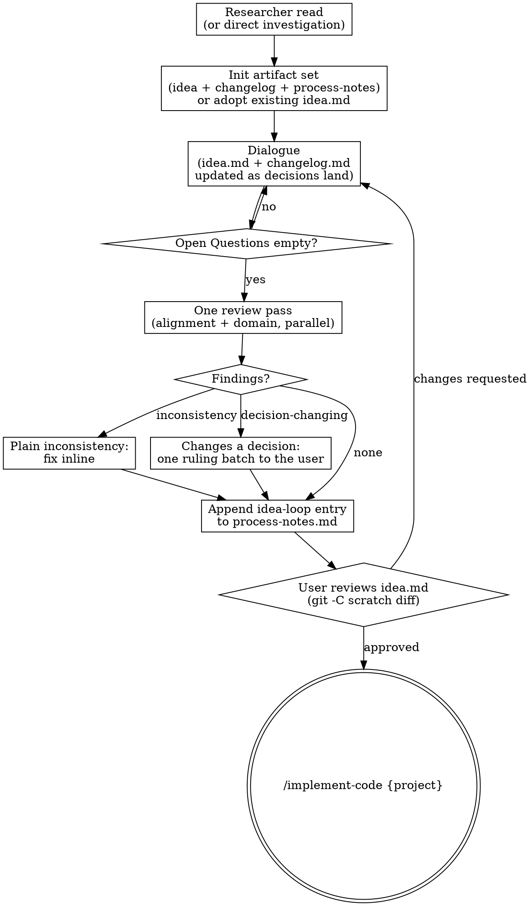

# Brainstorming Process Flow

The control graph for `brainstorming/SKILL.md`. `## The flow` in that file is authoritative;
this graph is the same flow drawn, for when the branch structure is easier to see than to read.

