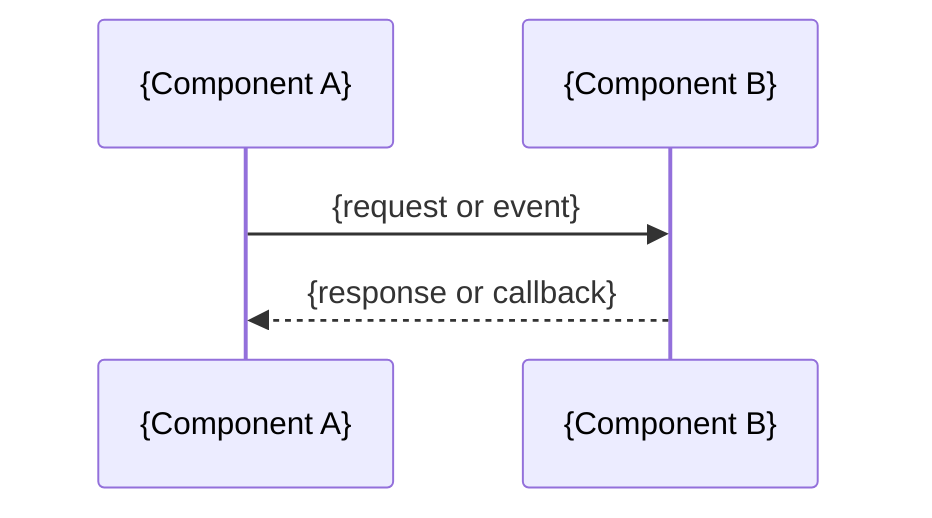

# {Project Name} — Spec

## Overview
{1-2 sentence summary of what this builds and why}

## Scope
**In:** {what we're building}
**Out:** {what's explicitly excluded}

## Architecture
{High-level structure — components, layers, key boundaries}

## Sequence Diagram
_Conditional — include when the spec involves any meaningful flow across multiple components or async boundaries. Omit entirely when not applicable._

## Components
### {Component Name}
- **Purpose:** {what it does}
- **Interface:** {how consumers use it}
- **Dependencies:** {what it needs}
- **Contract:** (for new public methods)
  - requires: {preconditions}
  - ensures: {postconditions}
  - invariants: {properties before AND after}
  - throws: {ExceptionType when condition}
- **Examples:** (for new public methods)
  - ✓ happy path: `{input}` → `{output}`
  - ✓ idempotent repeat: `{same input}` → `{same output}`
  - ✗ error: `{bad input}` → `{ExceptionType}`

## Data Model
{Schemas, tables, types, state shape — whatever applies}

## State & Transition Matrix
_Conditional — include when the spec's behavior varies by prior state (FSMs, workflow engines, resumable orchestrators, UI components with multiple display states). Omit entirely when not applicable._

State & Transition Matrix — required when behavior varies by prior state. See `plan-expert/ARTIFACTS.md` for forward-FSM and resumability templates.

## API / Interfaces
{Endpoints, function signatures, contracts between components}

## Error Handling
{How errors propagate, what's recoverable, what fails loudly}

## Testing
{What to test, coverage expectations, specific testing approaches decided during brainstorming}

## Constraints
{Technical and business constraints that shape implementation}

## Invariants
_Always present — list cross-cutting properties that must hold across all states and operations. If none apply, write the escape hatch below. Absence of this section (rather than the explicit escape hatch) is a spec smell and triggers ISSUES_FOUND from the reviewer._

- {invariant property that must always hold}
- {Must-Not expressed as negative form: "{X} never happens under any circumstances"}

_None — pure-function spec, no cross-cutting properties._ (use this escape hatch when no invariants apply)

## Skill Coverage
| Technology | Expert Skill | Status |
|-----------|-------------|--------|

## Success Criteria
{Measurable criteria — pulled from idea.md, refined for testability}
