# Discovery — Charting the Way to a Design

A loose idea has arrived, too big to decide in one session, and wrapped in fog: the way from here to
the **destination** is not visible yet. Discovery is about finding that way, not charging at the
destination. It charts the way as an **epic** in the issues corpus, breaks off what will not fit in
the conversation as **spikes** — questions whose resolution is a decision, not slices of a build —
and works them off the frontier until the route is clear.

This is the stage **upstream of `/brainstorming`**. It produces decisions, never design and never
code. It terminates by naming `/brainstorming` as the next command and stops there — except on the
destination-already-reached exit, where there is nothing left to design and it names nothing.

<HARD-STOP priority="CRITICAL-READ-FIRST">
Discovery never invokes `/brainstorming`, never writes an `idea.md` (not even a partial one), and
never writes implementation code. It ends by handing back to the user with a recommendation for what
to run next — `/brainstorming` on every exit but one. On the early exits it recommends and then asks
how they want to proceed; it does not declare the stage unnecessary and close.

This holds on **every** exit — the epic going clear after its last spike resolves, the no-fog early
exit below, and the destination-already-reached exit beside it, which is the one exception: it names
nothing as next, because there is no work left to design. A pre-seeded design document is the
translation step this pipeline removed after measuring it as its main defect-injection point;
structural stage separation is the whole reason `/implement-code` does not design and this stage does not
build.
</HARD-STOP>

<no-reviewer-agents priority="CRITICAL">
Discovery dispatches **no reviewer sub-agents**. The user is the gate throughout.

The reviewer contract gates an artifact against a completeness bar, and `## Not Yet Specified` is
deliberately incomplete — the kill mandate has nothing to bite on here. The one sub-agent this stage
does use is `researcher`, and only to resolve a research spike.
</no-reviewer-agents>

## Invocation

`/discovery` takes a single optional argument and no verb.

| Invocation | Mode | What happens |
|---|---|---|
| `/discovery` with a loose idea | **Chart** | Name the destination, create the epic, map the fog into it, and spike what needs its own conversation. |
| `/discovery {epic-slug}` | **Work** | Load the epic, take spikes off the frontier, resolving and recording each before the next. |

**Both modes run until one of two conditions trips, then stop** — charting is not exempt. Research
spikes count against neither: they are resolved by dispatched `researcher` agents in parallel and
cost the session almost nothing.

- **The record stops keeping up.** A spike's `## Resolution`, its `status` flip, and its gist in the
  epic are all written *before* the next spike is chosen; in Chart mode, every answer the grilling
  produces reaches the epic before the next question. The moment that slips, stop and write it.
  State that lives only in the conversation is the failure this stage exists to prevent.
- **The next question's framing depends on a decision made this session.** That one wants fresh
  judgment rather than the anchoring of the decision just before it. Leave it; `/pickup` makes the
  boundary cheap.

There is no fixed count, and the user may call the stop at any point. An earlier one-spike-per-session
cap came from upstream, where tickets are sized to a 100K-token agent session; a count is a proxy for
a context limit, and where the budget is much larger it fires wrong in both directions.

## Vocabulary

- **Epic** — the map. One file in the issues corpus carrying `role: epic`, holding only judgment:
  where this effort is going, what has been decided, what is still foggy, and what has been ruled
  out.
- **Spike** — a decision ticket. One file carrying `role: spike`, `epic: {slug}`, and `spike_type:`,
  belonging to one or more epics.
- **Frontier** — the spikes that are workable right now: open, and with every blocker resolved.
  Derived by query, never stored.
- **Fog** — in-scope questions that cannot be phrased precisely yet. They live in the epic's
  `## Not Yet Specified` section and graduate into spikes as the frontier advances.

Both epics and spikes are ordinary issues in `scratch/issues/`, distinguished by `role:`. There is no
per-epic folder. The corpus already supplies identity, lifecycle, validation, and git provenance, so
a separate location would reimplement six working things to hold four sections of judgment.

## The Epic Body

An epic is created by `write_issue` like any other capture, so it arrives with the server's fixed
skeleton — `## Summary`, `## Context`, `## Impact`, `## Related`, `## Notes`. Keep `## Summary`: the
corpus lint requires it. Then add the epic's own four sections.

```markdown
## Destination

<What reaching the end of this epic looks like: the design decision, the spec to hand to
/brainstorming, or the change this effort is finding its way to. One or two lines. Every session
orients to it before choosing a spike.>

## Decisions

<The index: one line per decision, enough to judge relevance. A decision from a spike names its slug
and gists what that spike's ## Resolution holds, never restating it; one settled in the charting
conversation itself has no spike behind it, carries no slug, and the line is the whole record.>

- {spike-slug}: <one-line gist of the answer>
- <one-line gist of a decision settled in conversation, no slug>

## Not Yet Specified

<In-scope fog: the suspected questions you can see coming but cannot phrase sharply yet. Graduates
into spikes as the frontier advances.>

## Out of Scope

<Work consciously ruled beyond the destination. Never graduates.>

- {spike-slug}: <the gist, plus why it sits past the destination>
```

<E11-blocking-rule priority="CRITICAL">
**Write the whole epic body — `## Destination` included — in the SAME edit that first touches the
file.**

`## Destination` is required on any file carrying `role: epic`, and that rule is enforced by a
PostToolUse hook. `write_issue` is an MCP call and fires no hook, so the skeleton it emits is safe.
But the first `Edit` or `Write` you make to that file is checked, and an epic without
`## Destination` at that moment ends the turn: the hook runs *after* the tool, so your edit did
land — it exits 2 and surfaces the finding, which you must fix before continuing. Do not re-issue
the edit believing it failed; add the missing section instead. There is no warn tier anywhere in
this corpus.

So: create the epic with `write_issue`, then add all four sections in one edit. Never add
`## Destination` in a later pass.
</E11-blocking-rule>

**The epic lists no open-spike inventory.** No count of open work, no table of what is left, no
"current status" line. Every count and every listing is derived at read time — by grep, or by
`scratch-memory epics frontier {epic-slug}`. Rebuilding a hand-maintained triage index under a new
name is the single failure mode this design exists to avoid: judgment about a moving corpus ages
well and an inventory of it does not.

## Spikes

A spike is created by `write_issue` with the epic/spike keys:

| Key | Value |
|---|---|
| `role` | `spike` |
| `epic` | the owning epic's slug; comma-separated with no spaces if it belongs to more than one |
| `spike_type` | `interview` \| `prototype` \| `research` \| `task` |
| `blocked_by` | comma-separated spike slugs — **wired in a second pass, never at creation** |

The server rejects a spike that names no epic, and rejects `spike_type` or `blocked_by` on a file
that is not a spike. Always supply `spike_type` at creation: the corpus lint requires it on every
spike, and the first hand-edit to a spike missing it is a blocked edit.

A spike's body is the question it resolves. The unit is a conversation: a spike is something you would
deliberately go and discuss separately. Neither a decision count nor a token number sizes it — one
blanket ruling can settle dozens of decisions, and a token budget is not estimable as you write it.

<D17-create-before-wire priority="CRITICAL">
**Create every spike first. Wire every `blocked_by` edge in a second pass.**

An edge naming a spike that does not exist yet is a blocking finding, so an edge written before its
target exists stops the authoring flow rather than flagging it. The order is always:

1. Create the epic (`write_issue`, then the one body edit).
2. Create every spike (`write_issue`, no `blocked_by` on any of them).
3. Second pass: hand-edit `blocked_by:` into the frontmatter of each spike that has blockers.

Omit `blocked_by` entirely when nothing blocks a spike. There is no empty-string form.
</D17-create-before-wire>

## Spike Types

Every spike is one of four types, and the type *is* its resolution rule.

| Type | Resolved by | Rule |
|---|---|---|
| `interview` | The user, in live conversation, via `discuss-methodology` | The defining property is **who decides**: the user does, in exchange, and the agent never answers its own questions or stands in for the user's side. `discuss-methodology` works the **question frontier** in rounds — ask the whole frontier, let the answers unlock the next one, and continue until nothing is left unasked. One round of questions is not a resolved spike. |
| `research` | The `researcher` agent | Dispatch it; capture the finding in the spike's `## Resolution`, and relay the trailer lines it returns. The one type that counts against neither stop condition. |
| `task` | Work that must happen before a decision can be made | The one type that *does* rather than decides — provisioning access, moving data so its shape can be seen. It earns its place by unblocking a decision, **not by delivering the destination**. Record what was done and any facts later spikes depend on. |
| `prototype` | A cheap, rough, concrete artifact to react to | Its `## Resolution` **must name at least one artifact by path or slug** — a rule the lint enforces, because a prototype's output is the evidence its decision rests on and free prose leaves it ungreppable. |

<D11-user-selects priority="CRITICAL">
Where a prototype spike produces more than one candidate, **the user selects. The agent never picks
for them.** Selecting among prototypes is the decision the spike exists to put to the user.
</D11-user-selects>

Resolve prototype spikes early where you can. An epic whose later spikes rest on assumptions the
earlier ones invalidated is the stale-epic failure mode, and an early concrete artifact is the
countermeasure. Nothing enforces this — it is judgment.

## Ask, Spike, or Fog?

**The deliverable is an uncovered map of the fog, not a list of spikes.** Charting is a conversation
that maintains an epic: a question asked and answered in the room is fog lifted, and the epic records
it. A spike is one tool, for the part of the fog that will not fit in the conversation you are in.
Reaching for one is a late and deliberate conclusion, never an early or light one.

The test is whether you can state the question **precisely now**, not whether you can answer it now —
and then whether answering it needs a conversation of its own.

- **Ask it now** — the default for a sharp question. You are already in the conversation; the answer
  becomes a line in `## Decisions` and the fog it covered is gone.
- **Spike it** only on an isolation signal: it needs preparation that does not exist yet, it would
  derail the current thread, or it wants judgment unanchored by a decision just made.
- **Leave it as fog** when you cannot yet phrase it that sharply at all.

Do not pre-slice the fog into spike-sized pieces. Fog is coarser than a spike, and one patch may
graduate into several spikes, or none, once the frontier reaches it. Converting a deliberate gap into
false precision is worse than leaving it dim.

`## Not Yet Specified` excludes what is already decided, what is already a live spike, and what is
out of scope.

## Out of Scope Is Not Fog

Fog gathers only *toward* the destination. The destination fixes the scope, so work beyond it is out
of scope: it is not fog, and it does not belong in `## Not Yet Specified`. Scope, not sharpness, is
what lands something there.

When a spike that already exists turns out to sit past the destination — mis-scoped in while
charting, or exposed by another resolution — **resolve it and record its line under `## Out of Scope`
instead of `## Decisions`.** Ruling something out of scope is a scoping act, not a step on the route,
and `## Decisions` records the route actually walked. Either section satisfies the lint; putting a
scope boundary in `## Decisions` would falsify the record `## Decisions` exists to keep.

Out-of-scope work never graduates. It returns only if the destination is redrawn, and then as a fresh
effort, not a resumption.

## Mode: Chart

1. **Ground the idea in the codebase, then name the destination.** Read first: find what already
   exists for this idea, what ships today, and what the relevant code actually does. Then load
   `discuss-methodology` and work its question frontier to pin down what this epic is finding
   its way to. The destination fixes the scope, so it is settled first. Bound it to one epic — an
   unbounded destination is what makes a map go stale.

   Reading before naming is what makes step 2's already-reached check possible at all. A
   destination named from the conversation alone can describe something that already ships, and
   nothing downstream will catch it.
2. **Grill again — map the fog with the user, breadth-first.** Load `discuss-methodology` a second
   time and fan out across the whole space rather than deep on any one thread, surfacing the open
   decisions and the first steps takeable now.

   **This pass happens with the user, not in your own head.** Two grilling passes precede any exit
   below, because the exit tests read what this pass surfaces. An agent that maps the fog privately
   is sizing the effort against its own guesses, and the questions it never asked are the ones that
   would have changed the size. If you are holding a list of sharp questions the user has not seen,
   you have not run this step yet — ask them.

   <D25-no-fog-exit priority="CRITICAL">
   **No exit here is reachable until step 2's grilling pass has actually happened.** These tests run
   on what the user told you, never on what you inferred alone.

   **Check first whether the destination is already reached** — the thing exists, or nothing is
   left to decide or build. That is its own exit: create no epic and no spikes, say what you found
   and on what evidence, and name **nothing** as next. `/brainstorming` designs work that is still
   ahead; naming it when there is no work sends the user to design something that already ships.
   Grounding the destination in the codebase before charting is what separates this from the exit
   below.

   **Then: did the grilling surface fog?** If it surfaced none — the route is already clear and the
   whole journey fits one session — you do not need an epic. Create no epic and no spikes.

   **Sizing belongs inside that one test, not above it.** Being able to phrase several sharp
   questions is ambiguous evidence, and most of them get asked in the room rather than spiked. Ask
   whether the fog you cannot cover in this conversation would exceed the session in front of you,
   counting the writing and not just the deciding. Neither an epic manufactured to exercise the
   machinery nor a dismissal that spares you the work is right; the grilling tells you which.

   **On this exit, recommend and then ask — never decide for the user.** Say what you found, say
   which decisions you counted, recommend `/brainstorming`, and ask how they would like to proceed.
   The user invoked this stage; silently overruling that is the failure this wording exists to
   prevent. If they want the epic charted anyway, chart it.
   </D25-no-fog-exit>

   **Create the epic the moment those exits are behind you — while the grilling is still running,
   not once it ends.** `write_issue` with `role: epic`, then one edit adding all four sections:
   Destination filled in, Decisions holding whatever the conversation has already settled, the fog
   so far sketched into Not Yet Specified, Out of Scope holding anything already ruled past the
   destination. From there it is refined continuously — every answer lands in it as it arrives, so
   the grilling runs against a written map, not a transcript. Waiting for the grilling to finish is
   what left seven decisions with nowhere to live in the session that wrote this rule.
3. **Create the spikes** — every question that wants its own conversation, with no `blocked_by`.
4. **Wire the edges** in a second pass.
5. **Fire the research spikes, then record what they returned.** For each `research` spike just
   created, dispatch a `researcher` agent to resolve it. These run in parallel.

   **You write the resolution, not the agent.** Take each agent's finding and apply Work mode
   step 4's three edits yourself — the dated `## Resolution`, the `status: resolved` flip, and the
   gist appended to the epic's `## Decisions`. `researcher` has `Write`/`Edit`, so say in the
   dispatch prompt that it is to return its finding and write nothing to `scratch/issues/`; two
   writers on one file produce a duplicated or half-applied resolution.

   **Relay what each agent persisted.** `researcher` also writes to the wiki on its own authority,
   and the trailer lines its contract requires are reproduced to the user as you record
   the finding — the obligation is the researcher skill's `## Dispatch Contract` § Trailer relay,
   inherited here rather than restated. A resolution recorded without them leaves the user unaware
   of pages the session wrote.

   Skipping this is silent. A spike left resolved-in-fact but still `status: open` with no
   `## Resolution` passes the session-end lint — the decision-record rule only reads spikes already
   marked resolved — so nothing fires, and the next session re-runs research you already paid for.
6. **Stop when a stop condition from Invocation trips** — the record has fallen behind, or the next
   question wants judgment unanchored by one just made — then **run the session-end lint** (below).
   Charting has no separate budget: while the record is current, keep going.

## Mode: Work

1. **Load the epic.** Read its body — the low-resolution view. Do not read every spike.
2. **Choose one spike.** If the user named one, use it. Otherwise take the frontier:

   ```bash
   scratch-memory epics frontier {epic-slug}
   ```

   It writes one ready spike slug per line and exits 0. **Empty output at exit 0 means every open
   spike is blocked** — a clean state, not an error. Say so and stop; there is nothing workable
   until a blocker resolves. Exit 1 means the slug names no epic, which is a mistyped argument
   worth surfacing, not an empty frontier.

   **If the epic has no open spikes at all, the epic is clear.** Run the session-end lint first —
   this is the branch where it matters most, since a spike that resolved in an earlier session
   without its gist reaching the epic never appears on the frontier and E5 is the only thing that
   catches it.

   **Then run `## The Breakdown Gate` below.** It is a conversation with the user and it writes a
   line to the epic; neither happens if you read straight to the stop. Only once its step 3 is on
   disk do you report the epic clear, name `/brainstorming` as the next command, and stop —
   without invoking it.
3. **Resolve it** per its type's rule above. Read related and resolved spikes on demand; that detail
   is not preloaded.
4. **Record the resolution.** Three hand edits, in this order — there is no tool that does any of
   them:
   - Append a dated `## Resolution (YYYY-MM-DD)` section to the spike stating concretely what was
     decided and on what evidence.
   - Flip the spike's frontmatter to `status: resolved`.
   - Append its one-line gist to the epic's `## Decisions` — or to `## Out of Scope` if the spike
     turned out to sit past the destination.
5. **Clear the fog the answer lifted.** Graduate any patch of `## Not Yet Specified` that is now
   sharp into fresh spikes (create-then-wire), and delete that patch from the section so it lives
   only as its new spikes. If the answer invalidates other spikes, update or resolve them.
6. **Take the next spike, or stop.** Unless a stop condition from Invocation has tripped — the
   record has fallen behind, or the next spike's framing depends on a decision made this session —
   return to step 2 and work the next frontier spike. When you do stop, **run the session-end
   lint**.

## The Breakdown Gate

Runs on the clear exit, before you name `/brainstorming`, and again every later time the epic is
clear — which is how decision 13's re-quiz happens: idea one ships, the user re-enters `/discovery`
on the same epic, Mode: Work finds no open spikes, and the gate re-runs against what shipping idea
one taught. Say that when you name the first idea, so the user knows what reopens the list. The epic
is where the evidence lives — the destination, the resolved decisions, the out-of-scope rulings — so this is the only
place the question can be asked against something written down.

**The question:** does the route to the destination want one design, or several designed in
sequence?

1. **Propose a breakdown as a strawman.** Name the ideas you would design, in the order you would
   design them, cut **vertically** — each one a complete path that ships something a user or an
   agent can exercise, not a layer of the whole. One idea is a legitimate strawman and often the
   right one; say so plainly rather than manufacturing a split.
2. **Load `discuss-methodology` and put three questions to the user**, iterating until they
   approve:
   - **Granularity** — is each idea the right size, or should any be split further?
   - **Blocking edges** — which ideas must land before which, and what does the first one have to
     prove?
   - **Merge or split** — should any two of these be one design, or any one of these be two?

   Two of the three invite a coarser cut, which is what keeps the strawman from anchoring the
   answer. The mechanism is an interview because the alternative — a final spike — resolves by
   silence, which is the failure this gate exists to prevent.

   **Done when** the user has answered all three and named the set of designs and the order they
   run in, or has said the strawman stands as proposed. `discuss-methodology` is relentless by
   design; this is the bar that stops it, and step 3 is what the answers are for.
3. **Record one line in the epic's `## Decisions`** naming the designs and their order, marked
   explicitly as a proposal rather than settled scope. Nothing else: no slice list, no status
   column, no build outcomes. Project folders at `scratch/{name}/` are the only inventory.

   **Done when** that line is in the epic's `## Decisions` on disk, names every design the user
   approved and the order they run in, and says "proposal" in so many words. This is the gate's
   only durable output — the interview is worthless without it, and the session-end lint runs
   before this step and cannot catch its absence.
4. **Name the first idea only.** `/brainstorming` designs one at a time. It gets designed, built,
   and shipped; then the list is re-quizzed before the second is designed, because what the first
   one taught is the main reason the order would change. The recorded list is never authoritative.

   **Done when** your closing message names exactly one idea as next and does not enumerate the
   rest as though they were queued.

**This gate creates nothing buildable.** It names designs; it does not slice units, order build
work, or write an `idea.md`. The HARD-STOP above holds through it unchanged — the epic cannot hold
build work, so there is nothing here to be pulled toward.

**An idea that arrives without an epic gets no breakdown check.** That is most `/brainstorming`
runs and it is accepted: the fix, if it ever bites, is to run `/discovery` first, which is what
this stage is for. A second gate downstream would put the same question in two homes, and two
homes drift.

## Session-End Lint

Before ending any discovery session, in either mode:

```bash
scratch-memory tasks lint scratch/issues/
```

Exit 0 is clean. Exit 1 prints one finding per line.

**This is the only thing that makes the decision-record rule fire.** Every other corpus rule runs on
the edit-time hook, but the rule that catches a spike resolved without its line reaching the epic
cannot: it is legitimately unsatisfied for the seconds between flipping a status and appending the
gist, so it would block that edit every time. It runs only in this directory sweep.

A finding naming a resolved spike with no matching line means exactly that: go append the gist to the
epic's `## Decisions` or `## Out of Scope`. Fix it; do not suppress it. Silent decision drift — a
spike resolves and its stone is never placed — is the mechanical-half rot that killed the corpus's
previous triage index, in miniature.

## Process Flow

```dot
digraph discovery {
    "Invoked with an idea\nor an epic slug" [shape=diamond];
    "Name the destination\n(discuss-methodology)" [shape=box];
    "Grill again: map the fog\nWITH the user" [shape=box];
    "Already reached?" [shape=diamond];
    "Any fog?" [shape=diamond];
    "Create the epic\n(+ body in ONE edit)" [shape=box];
    "Keep grilling; record\nevery answer in the epic" [shape=box];
    "Ask it now, spike it,\nor leave it as fog?" [shape=diamond];
    "Create every spike\n(no blocked_by)" [shape=box];
    "Wire blocked_by\n(second pass)" [shape=box];
    "Fire research subagents" [shape=box];
    "Record each research\nresolution (3 edits)" [shape=box];
    "Load the epic" [shape=box];
    "epics frontier" [shape=box];
    "Anything open?" [shape=diamond];
    "Take a frontier spike" [shape=box];
    "Resolve per its type" [shape=box];
    "Record: Resolution,\nstatus, epic gist" [shape=box];
    "Graduate cleared fog" [shape=box];
    "Stop condition?" [shape=diamond];
    "Session-end lint\n(tasks lint issues/)" [shape=box];
    "Breakdown gate\n(strawman + 3 questions)" [shape=box];
    "Stop: name /brainstorming\nas next" [shape=doublecircle];
    "Stop: recommend /brainstorming,\nTHEN ask the user" [shape=doublecircle];
    "Stop: nothing to do\n(name NOTHING as next)" [shape=doublecircle];
    "Stop: session complete" [shape=doublecircle];

    "Invoked with an idea\nor an epic slug" -> "Name the destination\n(discuss-methodology)" [label="loose idea\n(chart)"];
    "Invoked with an idea\nor an epic slug" -> "Load the epic" [label="epic slug\n(work)"];
    "Name the destination\n(discuss-methodology)" -> "Grill again: map the fog\nWITH the user";
    "Grill again: map the fog\nWITH the user" -> "Already reached?";
    "Already reached?" -> "Stop: nothing to do\n(name NOTHING as next)" [label="yes — it\nalready ships"];
    "Already reached?" -> "Any fog?" [label="no"];
    "Any fog?" -> "Stop: recommend /brainstorming,\nTHEN ask the user" [label="none, or it fits\none session — create NOTHING"];
    "Any fog?" -> "Create the epic\n(+ body in ONE edit)" [label="fog, and it exceeds\none session"];
    "Create the epic\n(+ body in ONE edit)" -> "Keep grilling; record\nevery answer in the epic";
    "Keep grilling; record\nevery answer in the epic" -> "Ask it now, spike it,\nor leave it as fog?";
    "Ask it now, spike it,\nor leave it as fog?" -> "Keep grilling; record\nevery answer in the epic" [label="ask it now (default),\nor leave it as fog"];
    "Ask it now, spike it,\nor leave it as fog?" -> "Create every spike\n(no blocked_by)" [label="fog mapped; spike what\nwants its own conversation"];
    "Create every spike\n(no blocked_by)" -> "Wire blocked_by\n(second pass)";
    "Wire blocked_by\n(second pass)" -> "Fire research subagents";
    "Fire research subagents" -> "Record each research\nresolution (3 edits)";
    "Record each research\nresolution (3 edits)" -> "Stop condition?";
    "Load the epic" -> "epics frontier";
    "epics frontier" -> "Anything open?";
    "Anything open?" -> "Session-end lint\n(tasks lint issues/)" [label="epic is clear"];
    "Anything open?" -> "Session-end lint\n(tasks lint issues/)" [label="all blocked"];
    "Anything open?" -> "Take a frontier spike" [label="frontier"];
    "Take a frontier spike" -> "Resolve per its type";
    "Resolve per its type" -> "Record: Resolution,\nstatus, epic gist";
    "Record: Resolution,\nstatus, epic gist" -> "Graduate cleared fog";
    "Graduate cleared fog" -> "Stop condition?";
    "Stop condition?" -> "epics frontier" [label="no — record\nwritten, next spike\nis independent"];
    "Stop condition?" -> "Session-end lint\n(tasks lint issues/)" [label="yes"];
    "Session-end lint\n(tasks lint issues/)" -> "Breakdown gate\n(strawman + 3 questions)" [label="epic is clear"];
    "Breakdown gate\n(strawman + 3 questions)" -> "Stop: name /brainstorming\nas next";
    "Session-end lint\n(tasks lint issues/)" -> "Stop: session complete";
}
```



## Key Principles

- **The map is the deliverable, not the spikes.** Charting maintains an epic in conversation; a
  spike is for the fog that will not fit in the conversation you are in.
- **The epic indexes what a spike holds, and stores what has no spike.** A spike's decision lives in
  that spike; the epic gists it and names the slug. One settled in conversation carries no slug, and
  its line there is the whole record.
- **Derive, never persist.** Counts and listings come from grep or `epics frontier` at read time. A
  static file cannot track a mutating corpus.
- **Refer to spikes by slug.** These slugs are kebab-case titles, so they read at a glance; that is
  what makes a bare slug legible where a bare number would not be.
- **One epic, one bounded destination.** Bounding the destination is the countermeasure practitioners
  converged on for map staleness.
- **Split on divergence, never on size.** Two lanes belong to one epic when they converge — when
  resolving a spike in one would change how you frame a spike in the other. Carrying several lanes
  back to one point is what an epic is *for*, so spike count is not a test. Split only when the lanes
  genuinely never meet: splitting forks the shared context, and the second epic re-derives what the
  first already learned.
- **Create before wire, always.** With no warn tier, an early edge blocks the edit.
- **The user is the gate.** No reviewer agents, and no agent picking among prototypes.
- **Stop at the handoff.** Producing a decision is the deliverable. Reading "epic" and starting to
  build is the drift this stage's whole shape guards against.

## Anti-Patterns

1. **Don't create an epic when charting found no fog.** The early exit is the point, not a corner
   case. An epic manufactured for a one-session decision costs every later reader the same load as a
   real one.
2. **Don't list open spikes in the epic.** Not as a table, not as a count, not as a "remaining work"
   line. That is the hand-maintained index this design deleted, growing back.
3. **Don't write `## Destination` in a second edit.** The first edit to an epic file is hook-checked
   and will be blocked. Body in one edit, always.
4. **Don't wire a `blocked_by` edge before its target file exists.** Same reason — it blocks rather
   than warns.
5. **Don't start the next spike before the last one's record is written.** Resolving in
   conversation and deferring the write-up is how an epic's state ends up living in a transcript
   nobody re-reads. Write the three edits, then choose.
6. **Don't put a scope ruling in `## Decisions`.** A spike ruled past the destination goes under
   `## Out of Scope`. `## Decisions` records the route actually walked.
7. **Don't pre-slice the fog.** If you cannot phrase the question sharply it is not a spike yet —
   and being able to phrase it sharply does not make it one either.
8. **Don't skip the session-end lint.** It is the only run that catches a resolved spike whose gist
   never reached its epic.
9. **Don't answer an `interview` spike yourself.** It resolves through live exchange with the user;
   an agent that answers its own questions has broken the type.
10. **Don't leave a research spike resolved-in-fact but `status: open`.** Charting fires research
    agents and the session ends; if you never write the three edits, the lint sees an open spike
    and stays silent, and the next session pays for the same research twice.
11. **Don't invoke `/brainstorming`, and don't start an `idea.md`.** Name it and stop, on every exit
    that names it at all — and on the destination-already-reached exit, name nothing.
12. **Don't take an early exit on a fog map you built alone.** Step 2's grilling is what the exit
    tests read. Producing the questions privately, answering them privately, then showing the user
    those questions as justification for an exit already taken is the same broken move as answering
    an `interview` spike yourself — and it ends the session the user opened.
13. **Don't declare the early exit; recommend it and ask.** The user invoked this stage. Telling
    them it was unnecessary and naming the next command is a decision made on their behalf.
14. **Don't split an epic because it has a lot of spikes.** "That is a lot of spikes" is a
    measurement, not a scoping test. Ask whether the lanes converge; a large epic whose lanes meet is
    the case this stage was built for.
15. **Don't file a spike for a question you could ask right now.** A sharp question in a live
    conversation is a question to ask, not a ticket. Rushing to create spikes and check them off is
    the shape this stage rots into most easily.

## Pointers

- `scratch-issues-methodology` — the corpus this stage writes into: frontmatter schema, the
  open/resolved pairing rule, the query cookbook, and the resolution procedure.
- `scratch-memory` — the `write_issue` tool contract and the `epics` / `tasks` CLI verb groups.
- `discuss-methodology` — the round-based interview this stage runs for every `interview` spike and
  for naming a destination. Its **question frontier** ranges over decisions inside one
  conversation; this stage's **spike frontier** ranges over spikes across sessions. Same idea, two
  granularities — say which one you mean.
- `interview-methodology` — the option-batch protocol for closing a decision whose options are
  already known. Not this stage's interview tool; reach for it only when a discussion has bottomed
  out on one genuinely enumerable choice.
- `/brainstorming` — the next stage, and the only thing this one hands off to.
