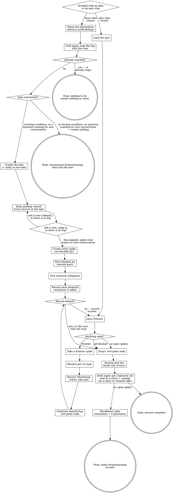

# Discovery process flow

Both modes as one graph. The steps themselves are [SKILL.md](SKILL.md) § Mode: Work and
[chart.md](chart.md); where this graph and the steps differ, the steps hold.

```dot
digraph discovery {
    "Invoked with an idea\nor an epic slug" [shape=diamond];
    "Name the destination\n(discuss-methodology)" [shape=box];
    "Grill again: map the fog\nwith the user" [shape=box];
    "Already reached?" [shape=diamond];
    "Epic warranted?" [shape=diamond];
    "Create the epic\n(+ body in one edit)" [shape=box];
    "Keep grilling; record\nevery answer in the epic" [shape=box];
    "Ask it now, spike it,\nor leave it as fog?" [shape=diamond];
    "Create every spike\n(no blocked_by)" [shape=box];
    "Wire blocked_by\n(second pass)" [shape=box];
    "Fire research subagents" [shape=box];
    "Record each research\nresolution (3 edits)" [shape=box];
    "Load the epic" [shape=box];
    "epics frontier" [shape=box];
    "Anything open?" [shape=diamond];
    "Take a frontier spike" [shape=box];
    "Resolve per its type" [shape=box];
    "Record: Resolution,\nstatus, epic gist" [shape=box];
    "Graduate cleared fog;\nrest-point walk" [shape=box];
    "Record behind?" [shape=diamond];
    "Stop's rest-point walk" [shape=box];
    "Session-end lint\n(tasks lint issues/)" [shape=box];
    "Drift ingest per Captured: dir\n(one at a time) + commit\n(on a lane) or /commit offer" [shape=box];
    "Breakdown gate\n(strawman + 3 questions)" [shape=box];
    "Stop: name /brainstorming\nas next" [shape=doublecircle];
    "Stop: recommend /brainstorming,\nthen ask the user" [shape=doublecircle];
    "Stop: nothing to do\n(name nothing as next)" [shape=doublecircle];
    "Stop: session complete" [shape=doublecircle];

    "Invoked with an idea\nor an epic slug" -> "Name the destination\n(discuss-methodology)" [label="loose idea\n(chart)"];
    "Invoked with an idea\nor an epic slug" -> "Load the epic" [label="epic slug\n(work)"];
    "Name the destination\n(discuss-methodology)" -> "Grill again: map the fog\nwith the user";
    "Grill again: map the fog\nwith the user" -> "Already reached?";
    "Already reached?" -> "Stop: nothing to do\n(name nothing as next)" [label="yes — it\nalready ships"];
    "Already reached?" -> "Epic warranted?" [label="no"];
    "Epic warranted?" -> "Stop: recommend /brainstorming,\nthen ask the user" [label="no forcing condition, no question\nwanting its own conversation\n— create nothing"];
    "Epic warranted?" -> "Create the epic\n(+ body in one edit)" [label="a forcing condition, or a\nquestion wanting its own\nconversation"];
    "Create the epic\n(+ body in one edit)" -> "Keep grilling; record\nevery answer in the epic";
    "Keep grilling; record\nevery answer in the epic" -> "Ask it now, spike it,\nor leave it as fog?";
    "Ask it now, spike it,\nor leave it as fog?" -> "Keep grilling; record\nevery answer in the epic" [label="ask it now (default),\nor leave it as fog"];
    "Ask it now, spike it,\nor leave it as fog?" -> "Create every spike\n(no blocked_by)" [label="fog mapped; spike what\nwants its own conversation"];
    "Create every spike\n(no blocked_by)" -> "Wire blocked_by\n(second pass)";
    "Wire blocked_by\n(second pass)" -> "Fire research subagents";
    "Fire research subagents" -> "Record each research\nresolution (3 edits)";
    "Record each research\nresolution (3 edits)" -> "Record behind?";
    "Load the epic" -> "epics frontier";
    "epics frontier" -> "Anything open?";
    "Anything open?" -> "Stop's rest-point walk" [label="no open spikes"];
    "Anything open?" -> "Stop's rest-point walk" [label="all blocked"];
    "Anything open?" -> "Take a frontier spike" [label="frontier"];
    "Take a frontier spike" -> "Resolve per its type";
    "Resolve per its type" -> "Record: Resolution,\nstatus, epic gist";
    "Record: Resolution,\nstatus, epic gist" -> "Graduate cleared fog;\nrest-point walk";
    "Graduate cleared fog;\nrest-point walk" -> "Record behind?";
    "Record behind?" -> "epics frontier" [label="no — record\nwritten"];
    "Record behind?" -> "Stop's rest-point walk" [label="yes, or the user\ncalls the stop"];
    "Stop's rest-point walk" -> "Session-end lint\n(tasks lint issues/)";
    "Session-end lint\n(tasks lint issues/)" -> "Drift ingest per Captured: dir\n(one at a time) + commit\n(on a lane) or /commit offer";
    "Drift ingest per Captured: dir\n(one at a time) + commit\n(on a lane) or /commit offer" -> "Breakdown gate\n(strawman + 3 questions)" [label="no open spikes"];
    "Breakdown gate\n(strawman + 3 questions)" -> "Stop: name /brainstorming\nas next";
    "Drift ingest per Captured: dir\n(one at a time) + commit\n(on a lane) or /commit offer" -> "Stop: session complete";
}
```
