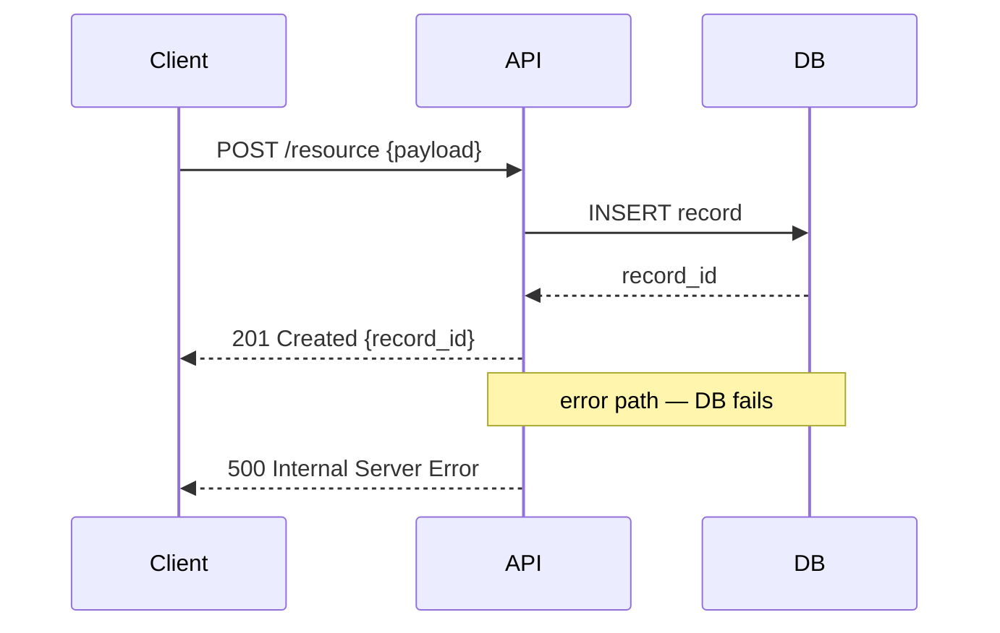

# Artifacts — Matching the Artifact

Structured artifacts outperform prose for combinatorial structural contexts because they make every cell of a state-space explicit — prose narrates the happy path while silently omitting error states, edge transitions, and contradictory conditions. Load this file when designing a plan step that introduces stateful behavior, multi-condition decisions, new public methods with invariants, or multi-service flows. The selection table below maps the structural trigger to the required artifact; each artifact section provides a copy-pasteable template and specific anti-patterns.

## Artifact Selection Table

| If the structural pattern includes… | Required artifact |
|---|---|
| Any meaningful flow involving multiple components or async boundaries | Mermaid Sequence Diagram |
| Behavior that varies by prior state (FSMs, workflow engines, resumable orchestrators) | State & Transition Matrix |
| Behavior that varies by prior state AND the system must be able to re-enter mid-flow | Resumability State Matrix |
| 3+ independent boolean conditions driving a decision | Decision Table |
| New public methods with preconditions or guaranteed postconditions | Method Contracts |
| New public methods with Method Contracts | Concrete Examples |
| Cross-cutting properties that must hold across all states | Invariants list |

## State & Transition Matrix

**When this fires:** The structural pattern involves an entity that behaves differently depending on which state it is currently in — state machines, workflow engines, or any component where the response to an event differs by history.

```markdown
## State & Transition Matrix
| Current State | Event / Input | Next State | Side Effect / Output |
|---|---|---|---|
| idle | start() | running | emit Started |
| running | pause() | paused | emit Paused |
| running | error | failed | emit Failed, log error |
| paused | resume() | running | emit Resumed |
| failed | retry() | running | increment attempt count |
| failed | abandon() | idle | clear context |

**Start state:** idle  **Terminal states:** (none)
```

**Anti-patterns:**
- Leaving cells empty for "obviously impossible" transitions — bugs hide in exactly those cells.
- Omitting error states because the happy path is the focus — every non-trivial system has failure transitions.

## Resumability State Matrix

**When this fires:** The entity is a resumable orchestrator or long-running workflow that must survive process restarts; the system must be able to re-enter from any non-terminal state without data loss.

```markdown
## Resumability State Matrix
| State | Resumable? | Re-entry Precondition | Re-entry Action |
|---|---|---|---|
| pending | yes | checkpoint exists with input params | re-queue with original params |
| running | yes | partial output saved to checkpoint | resume from last saved offset |
| completed | no | — | idempotent no-op if re-entered |
| failed | yes | failure reason logged | retry from last good checkpoint |
| cancelled | no | — | reject re-entry |

**Checkpoint format:** `{ state, input_params, output_offset, attempt_count }`
```

**Anti-patterns:**
- Marking all states "resumable: yes" without the re-entry precondition — resumability without preconditions is undefined behavior.
- Treating "completed" as resumable to handle idempotency — handle idempotency at the caller, not by re-entering a completed flow.
- Omitting the checkpoint format — the checkpoint IS the resumability contract; the matrix is incomplete without it.

## Decision Table

**When this fires:** A decision depends on 3 or more independent boolean conditions; each combination must have a defined outcome, and prose would require enumerating all paths verbally.

```markdown
## Decision Table: {Decision Name}
| Condition A | Condition B | Condition C | Outcome |
|---|---|---|---|
| true  | true  | true  | outcome-1 |
| true  | true  | false | outcome-2 |
| true  | false | true  | outcome-3 |
| true  | false | false | outcome-4 |
| false | true  | true  | outcome-5 |
| false | true  | false | outcome-6 |
| false | false | true  | outcome-7 |
| false | false | false | outcome-8 |
```

**Anti-patterns:**
- Collapsing rows with "otherwise" catch-alls before confirming the collapsed rows truly share an outcome — different outcomes hiding behind a wildcard are the most common source of decision bugs.
- Using conditions that are not independent (e.g., `user.isAdmin` and `user.role === 'admin'` are the same condition) — non-independent columns produce phantom rows with no real coverage.
- Stopping at 4 rows for 3 conditions — a 3-condition table has 8 rows; incomplete tables are ISSUES_FOUND.

## Method Contracts

**When this fires:** A new public method has a non-trivial precondition, guaranteed postcondition, or invariant that callers depend on.

```markdown
- **Contract:** {MethodName}({params})
  - requires: {precondition on input — what must be true before calling}
  - ensures: {postcondition on output — what is guaranteed after a successful call}
  - invariants: {properties that hold both before AND after the call}
  - throws: {ExceptionType when condition}
```

**Anti-patterns:**
- Writing `requires: valid input` — preconditions must be specific enough to implement as input validation.
- Omitting `throws` when the method can fail — callers cannot handle exceptions they don't know exist.

## Concrete Examples

**When this fires:** A Method Contract is present; examples verify the contract's `requires`/`ensures` are correct and give implementers unambiguous test fixtures.

```markdown
- **Examples:** {MethodName}
  - ✓ happy path: `methodName("abc", 3)` → `"abcabcabc"`
  - ✓ boundary: `methodName("", 0)` → `""`
  - ✗ violates requires: `methodName(null, 3)` → `ArgumentNullException`
```

**Anti-patterns:**
- Providing only happy-path examples — examples without error cases do not verify the `throws` clause.
- Paraphrasing inputs ("some string", "a negative number") instead of using literal values — examples are test fixtures; vague inputs cannot be run as tests.
- Providing examples that contradict the contract's `ensures` — self-contradictory specs produce implementations that can never pass both the contract and the test.

## Mermaid Sequence Diagram

**When this fires:** Any meaningful flow involving multiple components or async boundaries.

````markdown

````

**Anti-patterns:**
- Using ASCII art or prose to describe message flows when Mermaid renders clearly — prose flows are not verifiable.
- Omitting async boundaries (dashed return arrows) — synchronous and async returns look identical in prose but have different failure semantics.
- Drawing only the happy path — diagrams that omit error returns cannot be used to verify error-handling completeness.

## Invariants

**When this fires:** The structural pattern has cross-cutting properties that must hold in all states — always present; use the `_None_` escape hatch when genuinely inapplicable.

```markdown
## Invariants
- {Property that must always be true, stated in assertable form}
- {Example: "no PII is logged at any log level"}
_None — pure-function spec with no cross-cutting properties._
```

**Anti-patterns:**
- Omitting the section — absence signals the author never asked "what must always be true?", not that no invariants exist.
- Stating invariants that cannot be tested ("system is reliable") — must be specific enough to write an assertion against.

## Cross-Artifact Anti-Patterns

- **Populated matrix, no reachable-state check.** A state that appears only as a transition target but cannot be reached from any start state is dead code — looks covered, can never fire. Trace reachability from the declared start state before calling the matrix complete.
- **Contracts with `ensures` but no examples.** A postcondition without a concrete example is untestable; implementers will interpret it differently. Every `ensures` clause needs at least one `✓` happy-path example and one `✗` error example.
- **Invariants listed but no transition that could violate them.** If no code path could break the invariant, it is either a tautology (trivially structural, not worth stating) or the model is incomplete (the violating path exists but was not considered).
- **Decision table columns that overlap.** Logically dependent conditions produce phantom rows — some impossible, some duplicated — reducing effective coverage while appearing complete.

## See Also

- [Signals](SIGNALS.md) — Sibling page that defines fires-when signals for each artifact type ARTIFACTS.md describes. Reviewer reads SIGNALS.md to decide WHEN an artifact is required; ARTIFACTS.md provides the per-type templates.
