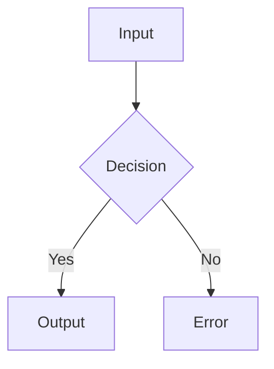

# Visual Companion

Show visual content to users via a localhost HTTP server. Claude writes HTML or Markdown files, the server serves them, and the user views them in their browser.

## When to Use

Decide per-question. The test: **would the user understand this better by seeing it than reading it?**

**Use the browser** when the content itself is visual:
- UI mockups, wireframes, layouts, navigation structures
- Architecture diagrams, data flow, relationship maps
- Side-by-side visual comparisons (layouts, color schemes, design directions)
- Design polish questions (look and feel, spacing, visual hierarchy)
- Spatial relationships (state machines, flowcharts, entity relationships)

**Use the terminal** when the content is text:
- Requirements and scope questions
- Conceptual A/B/C choices described in words
- Tradeoff lists, pros/cons, comparison tables
- Technical decisions (API design, data modeling)
- Clarifying questions

A question *about* a UI topic is not automatically visual. "What kind of wizard do you want?" is conceptual — terminal. "Which of these wizard layouts feels right?" is visual — browser.

## Markdown vs HTML

Write `.md` files for: diagrams (Mermaid), documentation, comparisons, decision tables, checklists, architecture overviews — anything text-structured. Write `.html` files for: pixel-precise mockups, interactive prototypes, complex CSS layouts, canvas animations. **Rule of thumb:** if it's content, use MD. If it's a visual design, use HTML.

### Markdown Plugin System (MUST USE)

MD files render client-side with rich plugins. **Before writing any `.md` file, you MUST use the Read tool on `plugin-reference.md` in this skill directory** to learn the full syntax. Do NOT write generic markdown when a plugin exists for what you need.

**Common plugins you MUST reach for:**

**Mermaid diagrams** — use for ANY architecture, flow, state, sequence, or relationship visualization:
````markdown

````

**Callout boxes** — use for notes, warnings, tips:
```markdown
> [!NOTE]
> Informational callout (blue)

> [!WARNING]
> Warning callout (orange)
```

**Interactive checkboxes** — use for checklists, decision tracking (clicks update source file):
```markdown
- [ ] Unchecked item
- [x] Checked item
```

**Collapsible sections** — use for details that shouldn't clutter the page:
```markdown
+++ Click to expand
Hidden content here.
+++
```

**Other plugins available:** KaTeX math, mind maps (markmap), diff visualization, Graphviz DOT, presentations (reveal.js), syntax highlighting, footnotes, definition lists, custom attributes, table of contents. See `plugin-reference.md` for full syntax.

**Anti-pattern:** Do NOT use ASCII art, plain code blocks, or text-based diagrams when a mermaid/graphviz diagram would render properly. Do NOT use plain bold/italic for emphasis when callout boxes communicate the intent better. The plugins exist — use them.

**Disable plugins per page:** append `?disable=mermaid,katex` to the URL.

## Markdown Events

Checkbox toggles in `.md` files are interactive — clicking updates the source file. Events are saved per-file to `{filename}.events` (e.g., `design.md.events`) as JSONL:

```jsonl
{"type":"checkbox","file":"design.md","line":6,"checked":true,"timestamp":1711800000}
```

Read the per-file events to see what the user checked/unchecked. These are independent from the global `.events` file used by HTML click events.

## Starting the Server

```bash
visual-companion start <screen_dir>
```

`start` is idempotent — call it every time you need the server. If already running, it returns the existing URL. If not running, it starts and returns the new URL. No need to check status first.

The `screen_dir` is where you write content files. Use a path relative to the current project (e.g., `scratch/my-feature/` or `.brainstorm/`).

After a crash or restart: `visual-companion restart` — reuses the same screen_dir and port.

> [!WARNING]
> Never launch the server script directly (e.g., `node scripts/server.cjs`). The `visual-companion` CLI manages the daemon lifecycle via `just-one` — direct launches create orphan processes that `stop` and `status` cannot track.

## The Loop

1. **Write content** to a file in `screen_dir`:
   - **Prefer `.md`** for most content (diagrams, docs, comparisons, checklists). Use `.html` only for pixel-precise mockups or interactive prototypes.
   - Use semantic filenames: `architecture.md`, `layout.html`, `color-palette.html`
   - Never reuse filenames — each screen gets a fresh file
   - Use the Write tool — never cat/heredoc
   - For iterations: `architecture-v2.md`, `layout-v3.html`

2. **Tell the user** what to expect:
   - Remind them of the URL
   - Brief text summary of what's on screen
   - Ask them to respond in the terminal

3. **Read feedback** on your next turn:
   - Read `<screen_dir>/.events` if it exists (user's browser clicks as JSONL)
   - Merge with the user's terminal text
   - Terminal message is primary; `.events` is supplemental

4. **Iterate or advance** — if feedback changes current screen, write a new version. Move on when validated.

5. **Waiting screen** — when returning to terminal-only questions, push a brief waiting screen to clear stale content:
   ```html
   <div style="display:flex;align-items:center;justify-content:center;min-height:60vh">
     <p class="subtitle">Continuing in terminal...</p>
   </div>
   ```

## Browser Tab Management

- Open a new browser tab for the server URL unless one is already open for the same URL
- Check via chrome-browser agent if available; otherwise tell the user the URL

## Server Routing

| Route | What it serves |
|-------|---------------|
| `/` | Auto-generated index listing all `.md` and `.html` files (newest first, with type badges) |
| `/{filename}.md` | Markdown rendered client-side via markdown-it + plugins in frame template |
| `/{filename}.html` | HTML — fragments wrapped in frame template, full documents served raw |
| `/files/{path}` | Static assets (images, CSS, etc.) |
| `POST /toggle` | Checkbox write-back — toggles `- [ ]` / `- [x]` in source `.md` file |

The index page and individual pages auto-reload when files change.

## Writing Content Fragments

Write just the inner content — the server wraps it in a themed frame automatically (header, dark mode CSS, selection indicator). Only write full HTML documents when you need complete control.

**Minimal example:**

```html
<h2>Which layout works better?</h2>
<p class="subtitle">Consider readability and visual hierarchy</p>

<div class="options">
  <div class="option" data-choice="a" onclick="toggleSelect(this)">
    <div class="letter">A</div>
    <div class="content">
      <h3>Single Column</h3>
      <p>Clean, focused reading experience</p>
    </div>
  </div>
  <div class="option" data-choice="b" onclick="toggleSelect(this)">
    <div class="letter">B</div>
    <div class="content">
      <h3>Two Column</h3>
      <p>Sidebar navigation with main content</p>
    </div>
  </div>
</div>
```

## CSS Classes Available

### Options (A/B/C choices)
`.options` container > `.option` items with `data-choice` and `onclick="toggleSelect(this)"`. Each option has `.letter` + `.content` > `h3` + `p`. Add `data-multiselect` to container for multi-select.

### Cards (visual designs)
`.cards` grid > `.card` items with `.card-image` + `.card-body` > `h3` + `p`.

### Layout helpers
- `.mockup` > `.mockup-header` + `.mockup-body` — preview container
- `.split` — side-by-side 2-column grid (responsive)
- `.pros-cons` > `.pros` + `.cons` — pro/con layout

### Wireframe elements
`.mock-nav`, `.mock-sidebar`, `.mock-content`, `.mock-button`, `.mock-input`, `.placeholder`

### Typography
`h2` (page title), `h3` (section), `.subtitle`, `.section`, `.label`

## Browser Events

User clicks are saved to `<screen_dir>/.events` (JSONL). Cleared when a new file is added.

```jsonl
{"type":"click","choice":"a","text":"Option A","timestamp":1706000101}
```

Last click is typically the final selection. If `.events` doesn't exist, use terminal text only.

## Managing Servers

```bash
visual-companion status          # List all running instances
visual-companion stop            # Stop current project's server
visual-companion stop <name>     # Stop specific instance
visual-companion stop --all      # Stop all instances
```

## Design Tips

- **Prefer `.md` over `.html`** — richer rendering with less effort (mermaid, callouts, checkboxes, collapsible sections)
- Scale fidelity to the question — wireframes for layout, polish for polish
- Explain the question on each page
- 2-4 options max per screen
- Use real content when it matters (e.g., actual images for a portfolio)
- Keep mockups simple — layout and structure, not pixel-perfect design
- **Use mermaid for any diagram** — flowcharts, state machines, sequences, ER diagrams. Never ASCII art.
