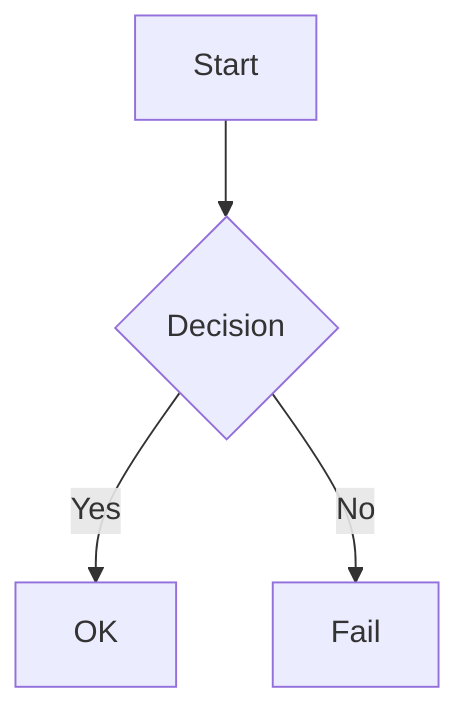
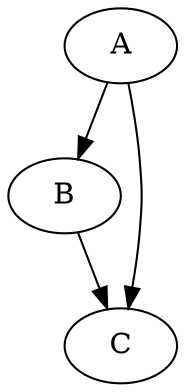

# Visual Companion — Markdown Plugin Reference

Full syntax reference for all supported plugins. Use the Read tool on this file when writing `.md` content for visual companion.

## Always-Loaded Plugins

### Mermaid Diagrams (lazy-loaded)
````markdown

````
Supports: flowchart, sequence, class, ER, Gantt, timeline, kanban, mindmap, git graph, pie, quadrant, sankey, XY chart, C4, block, and more. See [mermaid.js.org](https://mermaid.js.org/syntax/).

### Code Blocks (syntax highlighting)
````markdown
```javascript
function hello() { return 'world'; }
```
````
Languages auto-detected. Explicit lang tag recommended. Supported: js, ts, python, bash, json, css, xml/html, sql, csharp, java.

### Callout Boxes
```markdown
> [!NOTE]
> Informational callout (blue)

> [!TIP]
> Helpful tip (green)

> [!WARNING]
> Warning callout (orange)

> [!CAUTION]
> Danger callout (red)

> [!IMPORTANT]
> Important callout (purple)
```

### Task Lists (interactive checkboxes)
```markdown
- [ ] Unchecked item
- [x] Checked item
- [ ] Another item
```
Checkboxes are clickable — toggling updates the source `.md` file and writes to `{filename}.events`.

### Tables
```markdown
| Header 1 | Header 2 | Header 3 |
|----------|----------|----------|
| Cell A   | Cell B   | Cell C   |
| Cell D   | Cell E   | Cell F   |
```
Enhanced tables support colspan (`||`), rowspan (`^^`), and multi-line cells.

### Footnotes
```markdown
Some text with a footnote[^1] and another[^2].

[^1]: First footnote content.
[^2]: Second footnote content.
```

### Collapsible Sections
```markdown
+++ Click to expand
Hidden content here. Supports full markdown inside.
+++
```

### Table of Contents
```markdown
[[toc]]
```
Auto-generates from heading hierarchy. Place at top of document.

### Heading Anchors
All headings get auto-generated anchor links for deep-linking (e.g., `#architecture`).

### Custom Attributes
```markdown
# Heading {.custom-class #custom-id}

Paragraph with attributes. {style="color: red"}
```

### Text Formatting
```markdown
==highlighted text==
++inserted text++
~subscript~
^superscript^
:smile: :rocket: :warning:
```

### Definition Lists
```markdown
Term 1
: Definition of term 1

Term 2
: Definition of term 2
```

## Lazy-Loaded Plugins (heavy, loaded on demand)

### KaTeX Math
```markdown
Inline math: $E = mc^2$

Block math:
$$
\int_0^\infty e^{-x} dx = 1
$$
```

### Mind Maps (Markmap)
````markdown
```markmap
# Root
## Branch A
### Leaf 1
### Leaf 2
## Branch B
### Leaf 3
```
````
Renders interactive, zoomable SVG mind map from heading hierarchy.

### Diff Visualization
````markdown
```diff
- old line removed
+ new line added
  unchanged line
```
````
Renders as a side-by-side diff view with syntax highlighting.

### Graphviz (DOT)
````markdown

````

### Presentations (reveal.js)
````markdown
```slides
# Slide 1
Content for first slide
---
# Slide 2
Content for second slide
```
````

### Interactive Quizzes
````markdown
```quizdown
### What is 2+2?
- [ ] 3
- [x] 4
- [ ] 5
```
````

## Plugin Toggle

Disable plugins per page via query parameter:
```
http://localhost:PORT/file.md?disable=mermaid,katex
```

Plugin keys: `taskLists`, `sourceMap`, `callouts`, `footnote`, `collapsible`, `multimdTable`, `anchor`, `toc`, `mark`, `ins`, `sub`, `sup`, `deflist`, `emoji`, `attrs`, `highlightJs`, `mermaid`, `katex`, `markmap`, `diff2html`, `graphviz`, `revealJs`, `quizdown`
